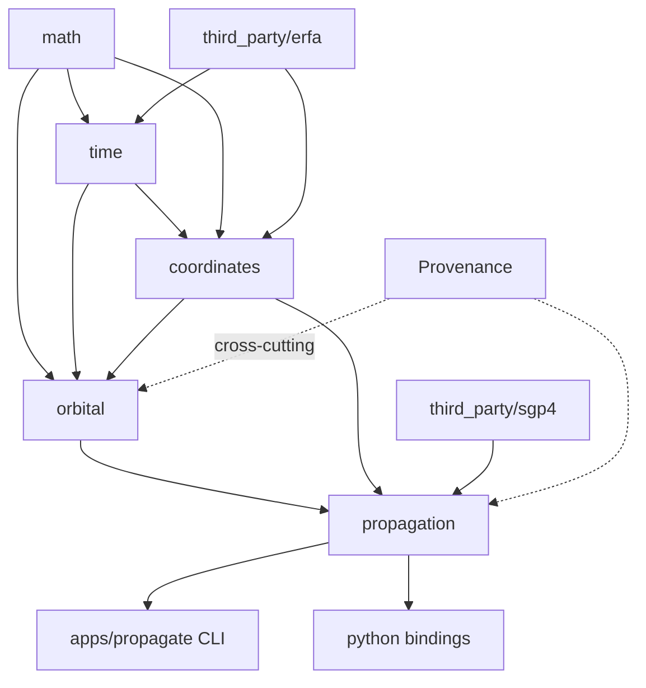

# orbitcore: An Engineering Guide to Building a Production-Quality C++ Orbital Mechanics Engine from Scratch to Milestone 1

## TL;DR
- **Build `orbitcore` as a modern-CMake, target-based C++20 *library first* (a single static library with per-module source groups), CLI second, bindings third** — require a CMake floor of 3.28 (current stable is 4.4.2, released 2026-07-31), use `FetchContent` for Eigen/GTest/spdlog, vendor the two C libraries (ERFA 2.0.1 and Vallado's SGP4) as isolated internal wrapper targets, and never let physics leak `#include <Eigen>` past your own `Vector3d` interface.
- **Milestone 1 is "done" when the engine can propagate a two-body Keplerian orbit AND an SGP4/TLE orbit, both emit provenance-tagged states (epoch, frame, units, model+version, propagator, config hash), everything is wrapped in Google Test, and the SGP4 path reproduces the canonical `tcppver.out` reference vectors to sub-millimeter agreement.**
- **The single highest-risk area is reference frames and time**: SGP4 emits TEME (not J2000/GCRF, an error worth up to kilometers), and time must never be a bare `double` — use a two-part Julian date via ERFA. Get these two contracts right and the rest of the engine composes cleanly.

---

## Key Findings

1. **Tooling is current and stable in 2026.** CMake stable is 4.4.2 (released 2026-07-31; 4.3.3 was the 21 May 2026 stable), so the 4.x line is mature — but you should require only **3.28** for portability, which still gives CMakePresets schema v6+, mature `FetchContent`, `gtest_discover_tests`, and full C++20. Eigen 5.0 ships a native `Eigen3::Eigen` INTERFACE target via `find_package(Eigen3 REQUIRED NO_MODULE)` (with version-range support such as `3.4...5` since Eigen 3.4.1); Google Test integrates via `FetchContent` + `gtest_discover_tests`; spdlog via `FetchContent` with a pinned tag (v1.14.1). `std::expected` is available (GCC 12+, Clang 16+/libc++), so a C++23 error path is viable if gated.

2. **The two C dependencies need you-authored wrapper targets.** ERFA 2.0.1 is a BSD-3-Clause C-API clone of IAU SOFA, equal to SOFA release 20231011, renaming all `iau` prefixes to `era`. Vallado's SGP4 (the 2023-05-09 release compiled by the official `python-sgp4`) is distributed as `SGP4.cpp`/`SGP4.h` + `testcpp.cpp`, with a core `elsetrec` struct and `sgp4init` / `sgp4` / `twoline2rv` functions, verified against `SGP4-VER.TLE` → `tcppver.out`.

3. **Precedent projects converge on the same patterns.** Tudat wraps SOFA and CSPICE in dedicated `sofa-cmake` / `cspice-cmake` repos — exactly the vendoring approach recommended here. Basilisk (University of Colorado AVS Lab + LASP) is a C/C++ core wrapped for Python via Conan+CMake. GMAT (NASA) is a large plugin-based C++ codebase. All treat the numerical core as a library independent of any UI.

4. **Frames and time are the classic failure points.** The literature (Vallado Algorithm 24) is unanimous: SGP4 output is TEME, and converting TEME→ECEF/J2000 requires precession (IAU-76), nutation (IAU-80), equation of equinoxes (1994), sidereal time, and polar motion — all present in ERFA as primitives (`eraPmat76`, `eraNut80`/`eraNumat`, `eraEqeq94`, `eraGst94`/`eraGmst82`, `eraPom00`), but with **no single `teme2ecef` function**. SGP4 itself has ~3 km position error at TLE epoch, so frame handling, not the propagator, is the audit surface.

5. **Tolerances are physics-driven.** Kepler-solver convergence to ~1e-10–1e-12 rad (typically <6 iterations for elliptic orbits); SGP4 validation to sub-millimeter vs `tcppver.out` (published to ~0.1 mm); frame round-trips to ~mm; energy conservation to relative ~1e-9 over an orbit. **Never use `-ffast-math`.**

---

## Details

### 1. HOW TO THINK ABOUT THE ENGINE BEFORE WRITING ANYTHING

**What "done" looks like for the milestone.** The engine milestone is complete when a *library* — not an app — exposes a small, stable, documented API that (a) represents state with explicit units/frame/epoch, (b) converts between Keplerian and Cartesian representations, (c) propagates a two-body orbit analytically, (d) propagates a TLE via SGP4, and (e) attaches provenance to every result. A thin CLI demonstrates the library; it contains no physics.

**The contract the engine exposes.** Think of `orbitcore` as a pure computational kernel with three contract guarantees:
- *Unit contract*: every public number is SI (meters, seconds, radians, kg) internally. Inputs in other units are converted at the boundary, never inside.
- *Frame contract*: every vector quantity is tagged with the reference frame it lives in (TEME, GCRF/J2000, ITRF/ECEF, …). Functions declare the frame they consume and produce.
- *Provenance contract*: every state carries a record of {epoch (with time scale), frame, units, model name+version, propagator name, config hash}. This is what makes results auditable by an aerospace engineer and reproducible across the .NET/Python consumers.

**Why library-first, CLI-second.** A library has one job: correct computation with a clean API. A CLI, a Python module, a web backend, and a .NET consumer are all *clients* of that job. If you build the CLI first, physics and I/O entangle, and you can never cleanly expose the engine to other consumers. Building the library first forces you to define the API contract explicitly and keeps the dependency graph acyclic. The CLI then becomes a ~200-line client that proves the library works end-to-end.

**Definition of Done (per module).** Each module is "done" only when ALL of the following hold:
- Public headers under `include/orbitcore/<module>/` compile standalone (self-sufficient includes).
- Every public function has a Doxygen block with equation reference (Vallado/Curtis/Montenbruck section), units, and frame of every parameter.
- Unit tests exist and pass; physics functions have at least one golden-vector validation test.
- No warnings under `-Wall -Wextra -Wpedantic -Werror`.
- clang-tidy and clang-format are clean.
- The module adds no new dependency edge that creates a cycle.
- ASan/UBSan build of the tests is green.

---

### 2. COMPLETE FOLDER STRUCTURE

```
orbitcore/                        # engine repo root (the C++ engine layer only)
├── CMakeLists.txt                # top-level: project(), options, add_subdirectory calls
├── CMakePresets.json             # configure/build/test presets (debug/release/asan/coverage)
├── CMakeUserPresets.json         # (gitignored) personal overrides
├── .clang-format                 # style config
├── .clang-tidy                   # static-analysis config
├── .gitignore                    # ignores build/, install/, CMakeUserPresets.json
├── LICENSE                       # your license; note MPL2 (Eigen) + BSD-3 (ERFA/GTest) obligations
├── VENDORED.md                   # exact versions/checksums/sources of vendored ERFA + SGP4
├── README.md
├── docs/
│   ├── adr/                      # Architecture Decision Records (0001-*.md ...)
│   └── Doxyfile.in
├── cmake/                        # CMake helper modules
│   ├── CompilerWarnings.cmake    # warning flags function applied per-target
│   ├── Sanitizers.cmake          # ASan/UBSan option function
│   ├── GitVersion.cmake          # embeds git SHA into version header
│   ├── WriteVersion.cmake        # runs at build time, configure_file's version.h.in
│   ├── orbitcoreConfig.cmake.in  # template for downstream find_package(orbitcore)
│   └── version.h.in              # configure_file template for version+SHA
├── include/
│   └── orbitcore/                # PUBLIC headers, namespaced by project
│       ├── math/
│       │   ├── Vector3d.hpp
│       │   ├── Matrix3d.hpp
│       │   ├── Quaternion.hpp
│       │   └── Integrators.hpp
│       ├── time/
│       │   ├── TimeScale.hpp
│       │   ├── Epoch.hpp
│       │   └── LeapSeconds.hpp
│       ├── coordinates/
│       │   ├── Frame.hpp
│       │   ├── Transform.hpp
│       │   ├── Geodetic.hpp
│       │   └── Topocentric.hpp
│       ├── orbital/
│       │   ├── KeplerianElements.hpp
│       │   ├── CartesianState.hpp
│       │   ├── KeplerSolver.hpp
│       │   └── Conversions.hpp
│       ├── propagation/
│       │   ├── IPropagator.hpp
│       │   ├── KeplerPropagator.hpp
│       │   └── Sgp4Propagator.hpp
│       ├── Provenance.hpp         # cross-cutting provenance record
│       └── orbitcore.hpp          # umbrella convenience header
├── src/                          # PRIVATE implementation, mirrors include/
│   ├── math/
│   │   ├── CMakeLists.txt
│   │   └── Integrators.cpp
│   ├── time/
│   │   ├── CMakeLists.txt
│   │   ├── Epoch.cpp
│   │   ├── LeapSeconds.cpp
│   │   └── ErfaTime.cpp          # thin wrapper over ERFA C calls (private)
│   ├── coordinates/
│   │   ├── CMakeLists.txt
│   │   ├── Transform.cpp
│   │   ├── Geodetic.cpp
│   │   ├── Topocentric.cpp
│   │   └── EopLoader.cpp
│   ├── orbital/
│   │   ├── CMakeLists.txt
│   │   ├── KeplerSolver.cpp
│   │   └── Conversions.cpp
│   ├── propagation/
│   │   ├── CMakeLists.txt
│   │   ├── KeplerPropagator.cpp
│   │   └── Sgp4Propagator.cpp    # wraps vendored SGP4, isolates elsetrec/TEME
│   └── Provenance.cpp
├── third_party/                  # vendored code with no/poor CMake support
│   ├── erfa/                     # ERFA 2.0.1 source (git submodule or copied)
│   │   └── CMakeLists.txt        # YOU write this to build the C sources
│   └── sgp4/                     # Vallado SGP4.cpp/SGP4.h (copied, pinned)
│       ├── SGP4.cpp
│       ├── SGP4.h
│       └── CMakeLists.txt        # YOU write this
├── apps/                         # CLI tools (clients of the library)
│   └── propagate/
│       ├── CMakeLists.txt
│       └── main.cpp
├── bindings/                     # pybind11/nanobind (M8)
│   └── python/
│       ├── CMakeLists.txt
│       └── module.cpp
├── tests/                        # tests mirror src/ layout
│   ├── CMakeLists.txt
│   ├── math/
│   │   └── test_vector3d.cpp ...
│   ├── time/
│   ├── coordinates/
│   ├── orbital/
│   └── propagation/
│       └── test_sgp4_validation.cpp
├── benchmarks/                   # micro-benchmarks (optional, Google Benchmark)
│   ├── CMakeLists.txt
│   └── bench_kepler.cpp
└── data/                         # reference/validation data + EOP + leap seconds
    ├── validation/
    │   ├── SGP4-VER.TLE
    │   └── tcppver.out
    ├── eop/
    │   └── finals2000A.all
    └── leapseconds/
        └── leap-seconds.list
```

**`include/` vs `src/`.** Public headers live under `include/orbitcore/<module>/`; private implementation lives under `src/<module>/`. This is a hard boundary: anything in `include/` is part of your API contract and must be stable and documented; anything in `src/` (including private helper headers) can change freely. Consumers add `include/` to their include path and write `#include <orbitcore/orbital/KeplerianElements.hpp>`.

**Why namespace headers by project (`orbitcore/`).** If your public header were simply `include/orbital/Conversions.hpp`, then any other library in a consumer's build that also ships `orbital/Conversions.hpp` would collide on the include search path. Prefixing every public header path with `orbitcore/` guarantees globally unique include paths (`#include <orbitcore/...>`) and mirrors the C++ namespace (`orbitcore::orbital`). This is the same convention Boost, Abseil, and most serious libraries use.

**Where tests live — recommendation.** Two options: (a) a top-level `tests/` tree mirroring `src/`, or (b) a `tests/` folder inside each module. **Recommendation: a top-level `tests/` mirroring `src/`.** For a solo developer with a superbuild, a single `tests/` tree is easier to configure (one `enable_testing()`, one place to add fixtures and shared validation data), and it keeps module `CMakeLists.txt` files focused purely on building the library. Per-module tests make more sense once modules become independently versioned/packaged, which is not the milestone-1 situation.

**Third-party/vendored code — `third_party/`.** Use `third_party/` (equivalently `extern/`; pick one). It holds code you did not write and do not want to modify: the ERFA C sources and the Vallado SGP4 `.cpp/.h`. Each gets a *you-authored* `CMakeLists.txt`.

**Validation data — `data/`.** Golden vectors (`tcppver.out`), input TLEs (`SGP4-VER.TLE`), Earth Orientation Parameters (`finals2000A.all`), and the leap-second table live under `data/`. Tests locate them via a configured path (a generated header constant or a CTest working-directory + relative path), never a hard-coded absolute path.

**CLI tools — `apps/`.** Use `apps/` for shipped executables (the `propagate` CLI). `tools/` is fine for dev-only scripts; keep the shipped CLI in `apps/` so its build/install rules are obvious.

**Benchmarks — `benchmarks/`.** Kept separate from `tests/` because they are opt-in (`-DORBITCORE_BUILD_BENCHMARKS=ON`) and must build in Release.

**CMake helpers — `cmake/`.** Reusable CMake functions (warnings, sanitizers, git version, install config template) live here and are `include()`d from the top-level list file.

**Naming conventions.**
- Directories & headers: lower-case module dirs (`orbital/`), PascalCase type headers (`KeplerianElements.hpp`), `.hpp` for C++ headers, `.cpp` for sources.
- Classes/structs/enums: PascalCase (`Epoch`, `KeplerianElements`, `TimeScale`).
- Functions/methods: `lowerCamelCase` — pick one convention and enforce via clang-tidy.
- Member variables: trailing underscore (`semiMajorAxis_`).
- Enumerators: PascalCase inside `enum class`.
- Namespaces: lower-case, nested by module: `orbitcore::math`, `orbitcore::time`, `orbitcore::coordinates`, `orbitcore::orbital`, `orbitcore::propagation`.

---

### 3. CMAKE SETUP — COMPLETE AND CONCRETE

**Modern, target-based CMake.** The entire build is expressed as *targets* with *usage requirements*. `target_link_libraries`, `target_include_directories`, and `target_compile_features` attach requirements to a target with `PUBLIC` / `PRIVATE` / `INTERFACE` scope:
- `PRIVATE` — needed to build this target, not propagated to consumers.
- `INTERFACE` — not needed to build this target, but propagated to consumers (header-only libs).
- `PUBLIC` — both (needed here *and* propagated).

Never call the directory-scoped `include_directories()` or `link_libraries()`: they apply globally to every target in scope, leak transitively in uncontrolled ways, and make it impossible to reason about who depends on what. Everything is per-target.

**Minimum CMake version.** Current CMake stable is **4.4.2** (2026-07-31); 4.3.3 was the 21 May 2026 stable. There is no reason to require the bleeding edge. **Require `cmake_minimum_required(VERSION 3.28)`** — this gives you CMakePresets schema v6+, mature `FetchContent`, `gtest_discover_tests`, and full C++20 support, while remaining installable from most distro/CI images. Do not require 4.x unless you need a specific 4.x feature.

**Top-level `CMakeLists.txt` (full content):**

```cmake
cmake_minimum_required(VERSION 3.28)

# Read version from a single source of truth; SHA is injected later.
project(orbitcore
    VERSION 0.1.0
    DESCRIPTION "Standalone C++20 orbital mechanics engine"
    LANGUAGES CXX C)                 # C is required: ERFA sources are C

# --- Global project policies (set once, applied via targets) ---
set(CMAKE_CXX_STANDARD 20)
set(CMAKE_CXX_STANDARD_REQUIRED ON)
set(CMAKE_CXX_EXTENSIONS OFF)        # -std=c++20, not -std=gnu++20
set(CMAKE_C_STANDARD 11)
set(CMAKE_C_STANDARD_REQUIRED ON)

# Put all binaries in predictable places.
set(CMAKE_RUNTIME_OUTPUT_DIRECTORY ${CMAKE_BINARY_DIR}/bin)
set(CMAKE_LIBRARY_OUTPUT_DIRECTORY ${CMAKE_BINARY_DIR}/lib)
set(CMAKE_ARCHIVE_OUTPUT_DIRECTORY ${CMAKE_BINARY_DIR}/lib)

# Generate compile_commands.json for clang-tidy / clangd / IDEs.
set(CMAKE_EXPORT_COMPILE_COMMANDS ON)

# Prevent in-source builds.
if(PROJECT_SOURCE_DIR STREQUAL PROJECT_BINARY_DIR)
    message(FATAL_ERROR "In-source builds are not allowed. Use a build/ dir.")
endif()

# --- Options ---
option(ORBITCORE_BUILD_TESTS      "Build unit tests"        ON)
option(ORBITCORE_BUILD_APPS       "Build CLI tools"         ON)
option(ORBITCORE_BUILD_BENCHMARKS "Build benchmarks"        OFF)
option(ORBITCORE_BUILD_PYTHON     "Build Python bindings"   OFF)
option(ORBITCORE_ENABLE_ASAN      "Enable AddressSanitizer" OFF)
option(ORBITCORE_ENABLE_UBSAN     "Enable UBSan"            OFF)
option(ORBITCORE_ENABLE_COVERAGE  "Enable coverage flags"   OFF)

# --- Helper modules ---
list(APPEND CMAKE_MODULE_PATH ${CMAKE_CURRENT_SOURCE_DIR}/cmake)
include(CompilerWarnings)     # defines orbitcore_set_warnings(target)
include(Sanitizers)           # defines orbitcore_enable_sanitizers(target)
include(GitVersion)           # generates version.h with PROJECT_VERSION + git SHA

# --- Third-party dependencies ---
include(FetchContent)

# Eigen 5.0 (header-only INTERFACE target Eigen3::Eigen)
find_package(Eigen3 3.4 QUIET NO_MODULE)
if(NOT Eigen3_FOUND)
    FetchContent_Declare(Eigen3
        GIT_REPOSITORY https://gitlab.com/libeigen/eigen.git
        GIT_TAG 5.0.0)
    set(EIGEN_BUILD_TESTING OFF CACHE BOOL "" FORCE)
    set(EIGEN_BUILD_DOC OFF CACHE BOOL "" FORCE)
    FetchContent_MakeAvailable(Eigen3)
endif()

# spdlog (pinned)
FetchContent_Declare(spdlog
    GIT_REPOSITORY https://github.com/gabime/spdlog.git
    GIT_TAG v1.14.1)
FetchContent_MakeAvailable(spdlog)

# Vendored C libraries (you author their CMakeLists.txt)
add_subdirectory(third_party/erfa)
add_subdirectory(third_party/sgp4)

# --- The engine library (aggregating target) ---
add_library(orbitcore)              # sources added by module subdirectories
add_library(orbitcore::orbitcore ALIAS orbitcore)

target_compile_features(orbitcore PUBLIC cxx_std_20)
target_include_directories(orbitcore
    PUBLIC
        $<BUILD_INTERFACE:${CMAKE_CURRENT_SOURCE_DIR}/include>
        $<INSTALL_INTERFACE:include>
    PRIVATE
        ${CMAKE_CURRENT_SOURCE_DIR}/src)

# Eigen is used in PUBLIC headers (Vector3d wraps it) -> PUBLIC.
target_link_libraries(orbitcore
    PUBLIC  Eigen3::Eigen
    PRIVATE spdlog::spdlog erfa sgp4)

orbitcore_set_warnings(orbitcore)
orbitcore_enable_sanitizers(orbitcore)

# Version header (generated) visible to the library.
target_include_directories(orbitcore PUBLIC
    $<BUILD_INTERFACE:${CMAKE_CURRENT_BINARY_DIR}/generated>)

# --- Module source subdirectories (they target_sources into orbitcore) ---
add_subdirectory(src/math)
add_subdirectory(src/time)
add_subdirectory(src/coordinates)
add_subdirectory(src/orbital)
add_subdirectory(src/propagation)

# --- Tests / apps / etc ---
if(ORBITCORE_BUILD_TESTS)
    enable_testing()
    add_subdirectory(tests)
endif()
if(ORBITCORE_BUILD_APPS)
    add_subdirectory(apps/propagate)
endif()
if(ORBITCORE_BUILD_BENCHMARKS)
    add_subdirectory(benchmarks)
endif()
if(ORBITCORE_BUILD_PYTHON)
    add_subdirectory(bindings/python)
endif()

# --- Install / export (see install section) ---
include(GNUInstallDirs)
install(TARGETS orbitcore erfa sgp4 EXPORT orbitcoreTargets
    ARCHIVE DESTINATION ${CMAKE_INSTALL_LIBDIR}
    LIBRARY DESTINATION ${CMAKE_INSTALL_LIBDIR}
    RUNTIME DESTINATION ${CMAKE_INSTALL_BINDIR})
install(DIRECTORY include/ DESTINATION ${CMAKE_INSTALL_INCLUDEDIR})
install(EXPORT orbitcoreTargets
    FILE orbitcoreTargets.cmake
    NAMESPACE orbitcore::
    DESTINATION ${CMAKE_INSTALL_LIBDIR}/cmake/orbitcore)
```

**Per-module `CMakeLists.txt` (pattern — e.g. `src/orbital/CMakeLists.txt`):**

```cmake
target_sources(orbitcore
    PRIVATE
        KeplerSolver.cpp
        Conversions.cpp)

# If this module needs a private dependency only for its .cpp files, add it here:
# target_link_libraries(orbitcore PRIVATE somedep)
```

The key idea: modules do not create their own libraries; they `target_sources()` into the single `orbitcore` target. Public headers are not listed here (they are found via the include path).

**One library vs one-target-per-module — evaluation and recommendation.**

| Approach | Pros | Cons | Verdict for orbitcore |
|---|---|---|---|
| **Single static lib, modules as source groups** | Simplest; fastest to link; no export/version proliferation; easy for solo dev | Module boundaries enforced only by convention | **Recommended for M1** |
| One `OBJECT` library per module, combined | Clean object separation; parallel compile; illegal cross-links become build errors | More CMake boilerplate; object-lib install quirks | Lightweight upgrade if you want enforced acyclicity now |
| One `STATIC`/`INTERFACE` lib per module (`orbitcore::math` etc.) | Enforces acyclic deps at link time; great for large teams | Most boilerplate; many install/export entries | Adopt later if modules grow independent |
| Shared (`.so`/`.dll`) | ABI stability for plugin loading | ABI/versioning burden; symbol-visibility work | Not now |

**Recommendation:** ship a **single static library** for milestone 1, with modules as directory-scoped source groups. Keep the *option* to migrate to per-module `INTERFACE`/`OBJECT` targets later — the folder structure already mirrors that decomposition, so the migration is mechanical. If you want CMake to *enforce* the acyclic dependency graph today, the lightweight compromise is one `OBJECT` library per module linked into the aggregate, so an illegal cross-module link becomes a build error.

**Static vs shared table:**

| | Static (`.a`/`.lib`) | Shared (`.so`/`.dll`/`.dylib`) |
|---|---|---|
| Link time | Baked into consumer | Resolved at load |
| Distribution | One self-contained artifact | Must ship + find lib at runtime |
| ABI stability | Not required | Required (visibility, versioned soname) |
| Best for | Embedding into CLI/py/.NET, reproducibility | Plugin systems, shared across many processes |
| **orbitcore choice** | **Yes (M1)** | Later, only if a plugin host needs it |

**`CMakePresets.json` (full content):**

```json
{
  "version": 6,
  "cmakeMinimumRequired": { "major": 3, "minor": 28, "patch": 0 },
  "configurePresets": [
    {
      "name": "base",
      "hidden": true,
      "generator": "Ninja",
      "binaryDir": "${sourceDir}/build/${presetName}",
      "cacheVariables": {
        "CMAKE_EXPORT_COMPILE_COMMANDS": "ON",
        "ORBITCORE_BUILD_TESTS": "ON"
      }
    },
    {
      "name": "debug",
      "displayName": "Debug",
      "inherits": "base",
      "cacheVariables": { "CMAKE_BUILD_TYPE": "Debug" }
    },
    {
      "name": "release",
      "displayName": "Release",
      "inherits": "base",
      "cacheVariables": { "CMAKE_BUILD_TYPE": "RelWithDebInfo" }
    },
    {
      "name": "asan",
      "displayName": "ASan+UBSan",
      "inherits": "debug",
      "cacheVariables": {
        "ORBITCORE_ENABLE_ASAN": "ON",
        "ORBITCORE_ENABLE_UBSAN": "ON"
      }
    },
    {
      "name": "coverage",
      "displayName": "Coverage",
      "inherits": "debug",
      "cacheVariables": { "ORBITCORE_ENABLE_COVERAGE": "ON" }
    }
  ],
  "buildPresets": [
    { "name": "debug",    "configurePreset": "debug" },
    { "name": "release",  "configurePreset": "release" },
    { "name": "asan",     "configurePreset": "asan" },
    { "name": "coverage", "configurePreset": "coverage" }
  ],
  "testPresets": [
    {
      "name": "debug",
      "configurePreset": "debug",
      "output": { "outputOnFailure": true },
      "execution": { "noTestsAction": "error", "stopOnFailure": false }
    },
    { "name": "asan",     "configurePreset": "asan",
      "output": { "outputOnFailure": true } },
    { "name": "coverage", "configurePreset": "coverage",
      "output": { "outputOnFailure": true } }
  ]
}
```

**Preset inheritance** works like class inheritance: a hidden `base` preset holds shared settings (generator, binary dir, common cache vars); concrete presets `inherits` it and override only what differs. `asan` inherits `debug` and just flips two options. Personal tweaks go in a gitignored `CMakeUserPresets.json` that inherits your shared presets (presets in `CMakePresets.json` may not inherit from `CMakeUserPresets.json`).

**Dependency management — comparison and per-dependency recommendation.**

| Method | How it works | Pros | Cons |
|---|---|---|---|
| `find_package` | Uses an installed lib's config package | Fast; system-managed; no rebuild | Consumer must install it first; version drift |
| `FetchContent` | Downloads+builds source at configure time | Reproducible; pinned tag; zero pre-install | Longer first configure; must trust upstream CMake |
| vcpkg | Manifest (`vcpkg.json`) + toolchain file | Big catalog; binary caching; VS integration; simpler for public deps | Global-ish; triplet-based rebuilds when settings differ |
| Conan 2.x | `conanfile` + profiles | Per-project versions; better caching/binary reuse; better for cross-compile and non-CMake builds | More setup; another tool to learn |
| git submodule | Source checked in as a submodule | Full control; offline builds | Manual update dance; easy to vendor badly |

Per-dependency recommendation for `orbitcore`:

| Dependency | License | Recommendation | Why |
|---|---|---|---|
| **Eigen 5.0** | MPL2 | `find_package(Eigen3 NO_MODULE)` with `FetchContent` fallback | Header-only; system copy fine, fallback guarantees CI reproducibility |
| **ERFA 2.0.1** | BSD-3 | **Vendor in `third_party/erfa` + you-authored `CMakeLists.txt`** | C library with autotools, not CMake; pin exact version for provenance |
| **GTest** | BSD-3 | `FetchContent` (pinned tag) | Canonical; avoids ABI mismatch with system copy |
| **spdlog** | MIT | `FetchContent` (pinned tag v1.14.1) | Simple, reproducible |
| **SGP4 (Vallado)** | Vallado terms (freely redistributable) | **Vendor in `third_party/sgp4` + you-authored `CMakeLists.txt`** | No upstream CMake; must pin the 2023-05-09 release for validation |
| **CSPICE** (later) | NAIF terms | Vendor like Tudat's `cspice-cmake` | Large C toolkit, no CMake; isolate it |
| **pybind11 / nanobind** (M8) | BSD-3 | `FetchContent` | Both offer first-class CMake; pick nanobind for new work |

**Handling C libraries in a C++ project.** Two adjustments: (1) enable C in `project(... LANGUAGES CXX C)`; (2) when a C header is included from C++, it must be wrapped `extern "C" { … }` (ERFA's own `erfa.h` already handles this; the SGP4 `.h` is C++, so no wrapping needed). Compile the C sources with the C compiler (CMake does this automatically based on the `.c` extension) and link the resulting archive as a `PRIVATE` dependency so its symbols do not leak into your public API.

**Wrapping a C library with no CMake support (ERFA — you author `third_party/erfa/CMakeLists.txt`):**

```cmake
# third_party/erfa/CMakeLists.txt  (ERFA 2.0.1, BSD-3)
# ERFA ships autotools, not CMake. We glob its C sources and build a static lib.
file(GLOB ERFA_SOURCES CONFIGURE_DEPENDS
     ${CMAKE_CURRENT_SOURCE_DIR}/src/*.c)
# Exclude the upstream test driver so it doesn't provide a second main().
list(FILTER ERFA_SOURCES EXCLUDE REGEX ".*t_erfa_c\\.c$")

add_library(erfa STATIC ${ERFA_SOURCES})
add_library(orbitcore::erfa ALIAS erfa)

target_include_directories(erfa
    PUBLIC ${CMAKE_CURRENT_SOURCE_DIR}/src)   # erfa.h, erfam.h live here
set_target_properties(erfa PROPERTIES
    C_STANDARD 99 POSITION_INDEPENDENT_CODE ON)
# Do NOT apply -Werror to third-party code; keep our strict flags off it.
```

Notes: prefer an explicit source list over `file(GLOB)` in production (glob won't re-run if a file is added without a reconfigure; `CONFIGURE_DEPENDS` mitigates this). ERFA 2.0.1 requires including `erfam.h` for macros; that is upstream's concern, not yours. This mirrors exactly what the Tudat team does with their `sofa-cmake` and `cspice-cmake` wrapper repos — take a plain C source tree and give it a hand-written CMake target. (ERFA can alternatively be "source-flattened" into a single `erfa.c`/`erfa.h` pair via upstream's `source_flattener.py`, which some projects prefer for vendoring.)

**Vendoring SGP4 (`third_party/sgp4/CMakeLists.txt`):**

```cmake
# third_party/sgp4/CMakeLists.txt
# Vallado SGP4, 2023-05-09 release. Files: SGP4.cpp, SGP4.h.
add_library(sgp4 STATIC SGP4.cpp)
add_library(orbitcore::sgp4 ALIAS sgp4)
target_include_directories(sgp4 PUBLIC ${CMAKE_CURRENT_SOURCE_DIR})
set_target_properties(sgp4 PROPERTIES POSITION_INDEPENDENT_CODE ON)
# Vallado code triggers many warnings; do not enforce -Werror here.
```

**Compiler flags (`cmake/CompilerWarnings.cmake`):**

```cmake
function(orbitcore_set_warnings target)
  if(MSVC)
    target_compile_options(${target} PRIVATE /W4 /permissive- /WX)
  else()
    target_compile_options(${target} PRIVATE
      -Wall -Wextra -Wpedantic -Werror
      -Wconversion -Wshadow -Wdouble-promotion
      -Wno-error=deprecated-declarations)
  endif()
  # CRITICAL: never enable -ffast-math anywhere in this project.
endfunction()
```

**Why `-ffast-math` is forbidden.** `-ffast-math` (and its components `-funsafe-math-optimizations`, `-ffinite-math-only`) tells the compiler it may assume no NaN/Inf, may reassociate floating-point operations, and may flush denormals. Orbital mechanics depends on *exact* IEEE-754 semantics: catastrophic-cancellation guards, NaN checks in the Kepler solver, and reproducible bit-for-bit results for validation all break under `-ffast-math`. It can silently change the last several digits of a state vector — fatal when you are validating against `tcppver.out` to sub-millimeter. Never use it; do not let a dependency turn it on either.

**Optimization & sanitizers.** Use `RelWithDebInfo` (`-O2 -g`) as the default "release" so validation runs with optimization but keeps debug symbols. Sanitizers per-target (`cmake/Sanitizers.cmake`):

```cmake
function(orbitcore_enable_sanitizers target)
  if(ORBITCORE_ENABLE_ASAN)
    target_compile_options(${target} PRIVATE -fsanitize=address -fno-omit-frame-pointer)
    target_link_options(${target} PRIVATE -fsanitize=address)
  endif()
  if(ORBITCORE_ENABLE_UBSAN)
    target_compile_options(${target} PRIVATE -fsanitize=undefined -fno-sanitize-recover=all)
    target_link_options(${target} PRIVATE -fsanitize=undefined)
  endif()
  if(ORBITCORE_ENABLE_COVERAGE)
    target_compile_options(${target} PRIVATE --coverage -O0 -g)
    target_link_options(${target} PRIVATE --coverage)
  endif()
endfunction()
```

Set flags per-target (via these functions), never with global `add_compile_options()` / `CMAKE_CXX_FLAGS` edits, so third-party targets are unaffected.

**Install & export.** The `install(TARGETS ... EXPORT orbitcoreTargets)` + `install(EXPORT ...)` + a `orbitcoreConfig.cmake.in` (configured with `configure_package_config_file` and `write_basic_package_version_file`) lets downstream projects do `find_package(orbitcore)` and link `orbitcore::orbitcore`. **Why it matters for the .NET/Python consumers:** those consumers embed the engine via a build step; a proper config package means they add one `find_package` line instead of hand-managing include paths and library files, and CMake propagates the Eigen PUBLIC requirement automatically. Your `orbitcoreConfig.cmake.in` must call `find_dependency(Eigen3)` since Eigen appears in your public headers.

**Versioning & git SHA for provenance.** `project(VERSION 0.1.0)` sets `PROJECT_VERSION`. Generate a `version.h` from a template so the *provenance record* can embed the exact source revision. Because a plain configure-time `execute_process(git rev-parse)` only runs at configure time (stale after later commits), use a small custom target that regenerates the header at build time (`cmake/GitVersion.cmake`):

```cmake
# cmake/GitVersion.cmake
find_package(Git QUIET)
set(GEN_DIR ${CMAKE_BINARY_DIR}/generated/orbitcore)
add_custom_target(orbitcore_version
  BYPRODUCTS ${GEN_DIR}/version.h
  COMMAND ${CMAKE_COMMAND}
          -D SRC=${CMAKE_SOURCE_DIR}/cmake/version.h.in
          -D DST=${GEN_DIR}/version.h
          -D VERSION=${PROJECT_VERSION}
          -P ${CMAKE_SOURCE_DIR}/cmake/WriteVersion.cmake
  COMMENT "Embedding git SHA into version.h")
add_dependencies(orbitcore orbitcore_version)
```

where `version.h.in` contains `#define ORBITCORE_VERSION "@VERSION@"` and `#define ORBITCORE_GIT_SHA "@GIT_SHA@"`, and `WriteVersion.cmake` runs `git rev-parse --short HEAD` (plus a dirty flag) and `configure_file`s the template. The provenance record reads these constants so every emitted state can be traced to an exact build. (The community `cmake-git-version-tracking` module by Andrew Hardin automates precisely this pattern if you prefer a ready-made helper.)

**Out-of-source builds, `.gitignore`.** Always build in `build/` (the presets enforce `${sourceDir}/build/${presetName}`). `.gitignore` should include `build/`, `install/`, `CMakeUserPresets.json`, and IDE dirs.

**Tests.** `enable_testing()` at top level, then in `tests/CMakeLists.txt` use `include(GoogleTest)` and `gtest_discover_tests(<test-target>)` so each `TEST()` becomes an individual CTest case (better than `add_test` on the whole binary — you get per-test reporting and parallelism). Run with `ctest`.

**ccache/sccache, Ninja, parallel builds.** Use the **Ninja** generator (already in the presets) for fast incremental builds and correct parallelism. Enable a compiler cache with `set(CMAKE_CXX_COMPILER_LAUNCHER ccache)` (or `sccache`) — this makes CI and clean rebuilds dramatically faster and is nearly free to add. Ninja parallelizes automatically; with Make use `cmake --build build -j`.

---

### 4. WHAT EACH FILE SHOULD CONTAIN (SPECIFICATION, NOT CODE)

#### core/math

- **`Vector3d.hpp`** — declares `orbitcore::math::Vector3d`, a thin wrapper (or type alias with helpers) over `Eigen::Vector3d`. Responsibility: be the single 3-vector type used across the engine so Eigen never appears in *other* modules' public signatures beyond this. Public surface: construction from three doubles, element access, dot/cross, norm, normalization, arithmetic operators. Invariant: components are always SI (meters for position, m/s for velocity — the *type* does not encode which; naming and provenance do). Header-only (inline/`constexpr` where possible).
- **`Matrix3d.hpp`** — declares `Matrix3d` (rotation/DCM usage), wrapping `Eigen::Matrix3d`. Public surface: identity, multiplication, transpose, matrix-vector product, orthonormality check helper. Header-only.
- **`Quaternion.hpp`** — declares `Quaternion` for attitude (used later by core/attitude). Public surface: construction, normalization, conjugate/inverse, rotation composition, conversion to/from `Matrix3d`. Invariant: attitude quaternions are unit-norm; provide a `normalized()` and a norm-check for tests. Header-only.
- **`Integrators.hpp` + `Integrators.cpp`** — declares fixed-step **RK4** and (later) adaptive **RKF45 / Dormand-Prince** as generic functions templated on a state type and a derivative functor. Public surface: a `step()` / `integrate()` signature taking (state, t0, dt, derivative-callable) and returning the advanced state; adaptive variants also take absolute/relative tolerances and return the accepted step. Responsibility: pure numerical integration, no physics. The template core is header-only; any non-template helpers compile in the `.cpp`. Math to understand first: Runge-Kutta methods (Curtis appendix; Montenbruck & Gill §4.1; Vallado §8.5).

#### core/time

- **`TimeScale.hpp`** — declares `enum class TimeScale { UTC, TAI, TT, UT1, TDB }`. Responsibility: make the time scale part of the *type system* so a UTC epoch cannot be silently used where TT is required.
- **`Epoch.hpp` + `Epoch.cpp`** — declares `orbitcore::time::Epoch`. **What it stores:** a two-part Julian date (two `double`s whose sum is the JD) **plus** a `TimeScale`. **Why never a bare double:** a single IEEE-754 double holding a modern JD (~2.46e6) exhausts most of its 52-bit mantissa on the integer day, leaving only tens-of-microseconds resolution — inadequate for orbital work where sub-microsecond timing maps to meters of along-track error. The two-part representation (ERFA convention) keeps the day number in one double and the fraction in the other, preserving full resolution; ERFA explicitly documents this split as "designed to preserve time resolution." Public surface: named constructors (`fromUtcCalendar(...)`, `fromJd(day, frac, scale)`, `fromMjd(...)`), conversions (`toScale(TimeScale)`), difference in seconds, comparison operators. Invariant: the scale is always explicit; conversions between scales go through the ERFA wrapper, never ad-hoc arithmetic.
- **`LeapSeconds.hpp` + `LeapSeconds.cpp`** — declares leap-second table handling. Responsibility: obtain ΔAT (TAI−UTC) for a given UTC date. Design: delegate to ERFA's `eraDat` for the built-in table, but allow overriding/loading an updated `leap-seconds.list` so the engine is not frozen to ERFA's compiled-in table. Public surface: `deltaAT(Epoch utc)`; loader for an external file.
- **`ErfaTime.cpp`** (private, under `src/time/`) — the thin C++ wrapper over ERFA's C API. Responsibility: isolate *all* ERFA calls behind C++ functions so the rest of the engine never touches raw ERFA. It calls `eraDat` (leap seconds), `eraUtctai` (UTC→TAI), `eraTaitt` (TAI→TT, the fixed +32.184 s offset), and `eraUtcut1`/`eraDtf2d`/`eraD2dtf` as needed. Design rule: convert `Epoch` → ERFA's two doubles, call ERFA, wrap the returned status code into your error-handling strategy. Math to understand first: time scales (Vallado §3.5; Montenbruck & Gill §2.3) — the UTC→TAI→TT chain and why UT1 needs EOP.

#### core/coordinates

- **`Frame.hpp`** — declares `enum class Frame { GCRF, J2000, TEME, ITRF, ECEF, ... }`. Responsibility: make frames explicit and type-checkable.
- **`Transform.hpp` + `Transform.cpp`** — declares frame-transform functions. Signature design: a transform takes (input vector or state, source `Frame`, target `Frame`, `Epoch`, and EOP data handle) and returns the transformed vector/state. **Why epoch-stamped:** every Earth-related frame transform (precession, nutation, sidereal rotation, polar motion) is a function of time; a transform without an epoch is meaningless. Milestone-1 scope: the TEME→ECEF pipeline (needed for SGP4) and ECI↔ECEF. Implementation uses the ERFA primitives `eraPmat76` (IAU-76 precession), `eraNut80`/`eraNumat` (IAU-80 nutation), `eraEqeq94` (equation of equinoxes), `eraGst94`/`eraGmst82` (sidereal time), and `eraPom00` (polar motion) — assembled per Vallado Algorithm 24, since ERFA has no single `teme2ecef`.
- **`Geodetic.hpp` + `Geodetic.cpp`** — geodetic↔ECEF conversions (latitude/longitude/altitude ↔ Cartesian, WGS-84 ellipsoid). Public surface: `geodeticToEcef(...)`, `ecefToGeodetic(...)`. Math: Vallado §3.2 (site/geodetic); iterative latitude solution edge cases at the poles.
- **`Topocentric.hpp` + `Topocentric.cpp`** — ENU / azimuth-elevation-range from an observer site. Math: Vallado §4.4 (rv2azel).
- **`EopLoader.cpp`** — loads and caches Earth Orientation Parameters (`finals2000A.all`: xp, yp, ΔUT1, ΔAT). Responsibility: parse once, cache, interpolate to epoch. Design: transforms *ask* the loader for EOP at an epoch; the loader owns file parsing and caching so transforms stay pure.

#### core/orbital

- **`KeplerianElements.hpp`** — declares the `KeplerianElements` struct: semi-major axis (m), eccentricity, inclination (rad), RAAN (rad), argument of periapsis (rad), true anomaly (rad), plus μ (or a reference to the central body). Responsibility: canonical element representation. Invariants documented: e ∈ [0,1) ellipse, e=1 parabola, e>1 hyperbola; angle ranges; singular-element notes.
- **`CartesianState.hpp`** — declares `CartesianState`: position `Vector3d` (m), velocity `Vector3d` (m/s), the `Frame`, the `Epoch`, and a `Provenance`. Responsibility: the engine's fundamental state object.
- **`KeplerSolver.hpp` + `KeplerSolver.cpp`** — declares the Kepler-equation solver: given mean anomaly M and eccentricity e, return eccentric anomaly E (elliptic), or the hyperbolic/parabolic analog. Design: Newton-Raphson with a good initial guess (E₀ = M + e·sin M for ellipse), quadratic convergence, iteration cap, convergence criterion on |ΔE| (≈1e-10–1e-12 rad; standard solvers converge within ~6 iterations for typical elliptic orbits and within 10 to machine precision). **Edge cases to specify:** e→0 (near-circular: E≈M, guard divisions), e→1 (near-parabolic: Newton can diverge — tighten tolerance and/or use a series/Barker's-equation path), hyperbolic e>1 (solve M = e·sinh H − H with the hyperbolic Newton form and cosh/sinh guards for large H). Math: Vallado §2.2 / Algorithm 2 (KepEqtnE), Curtis Ch. 3, Montenbruck & Gill §2.2.4.
- **`Conversions.hpp` + `Conversions.cpp`** — declares elements↔Cartesian conversions and vis-viva helpers. Signatures: `keplerianToCartesian(KeplerianElements, mu) -> CartesianState`, `cartesianToKeplerian(CartesianState, mu) -> KeplerianElements`, `visVivaSpeed(r, a, mu)`. **Singularities to document:** RAAN undefined for equatorial orbits (i≈0); argument of periapsis undefined for circular orbits (e≈0) — specify equinoctial-style fallbacks or explicit special-case handling. Math: Vallado §2.5 / Algorithms 9 & 10 (RV2COE, COE2RV), Curtis Ch. 4.

#### core/propagation

- **`IPropagator.hpp`** — declares the propagator interface: a pure-virtual `propagate(Epoch target) -> CartesianState` (and/or `propagate(duration)`), plus metadata accessors (name, model version) feeding provenance. Responsibility: the polymorphic contract all propagators satisfy so the CLI and consumers are propagator-agnostic. Keep it minimal.
- **`KeplerPropagator.hpp` + `KeplerPropagator.cpp`** — analytic two-body propagator. Design: constructed from an initial `CartesianState` or `KeplerianElements` + μ; `propagate()` advances mean anomaly by n·Δt, solves Kepler, converts back to Cartesian. Emits provenance {propagator="Kepler", model="two-body", frame=input frame}. Math: Vallado §2.2 (Kepler's problem), Curtis Ch. 3.
- **`Sgp4Propagator.hpp` + `Sgp4Propagator.cpp`** — wraps the vendored Vallado SGP4. Design: constructed from a parsed TLE/OMM; internally holds a Vallado `elsetrec` (the SGP4 satellite-record struct) and calls `sgp4init` once, then `sgp4(satrec, tsince)` per propagation. **Isolation rules:** the raw `elsetrec` and the `#include "SGP4.h"` appear *only* in this `.cpp` (behind PIMPL — never in the public header); the public header exposes only orbitcore types. **Frame:** SGP4 output is **TEME** — the propagator must stamp `Frame::TEME` on the result and *not* silently claim J2000/GCRF. Downstream TEME→ECEF/J2000 conversion is the caller's explicit step via core/coordinates. Math: Vallado et al., "Revisiting Spacetrack Report #3" (AIAA 2006-6753); Montenbruck & Gill §2.5.
- **TLE/OMM parser** — recommendation: use Vallado's `twoline2rv` inside the wrapper (it fills `elsetrec` directly and is validated), and additionally provide a thin orbitcore-typed TLE struct for the public API. Store the raw TLE strings in provenance.

**Vendoring the SGP4 C++ reference — how.** Copy the 2023-05-09 `SGP4.cpp` and `SGP4.h` into `third_party/sgp4/`, pin the exact version in `VENDORED.md` (version, date, source URL, checksum), build them as the isolated `sgp4` static target, and link it `PRIVATE` to `orbitcore`. The `elsetrec` struct and `sgp4init`, `sgp4`, `twoline2rv` are the only entry points you need. Keep the upstream files byte-for-byte unmodified (do not reformat) so future upstream diffs stay reviewable; put any adaptation in your wrapper `.cpp`, not in the vendored files. (Note: older mirrors split the code into `sgp4unit`/`sgp4io`/`sgp4ext` — confirm which layout your download uses and adjust the source list accordingly.)

**Include-what-you-use, forward declarations, PIMPL.** Each header includes exactly what it uses and forward-declares where a full definition isn't needed. Use **PIMPL** in `Sgp4Propagator` to hide the `elsetrec` member entirely from the public header (a `std::unique_ptr<Impl>`), so no consumer transitively sees SGP4 internals and compile times stay low.

**Error-handling strategy — evaluation and recommendation.**

| Strategy | Pros | Cons | Fit for a numerical library |
|---|---|---|---|
| Exceptions | Clean happy-path; carries rich context | Cost on throw; discouraged in hot loops; awkward across FFI/bindings | Good for *construction/validation* errors |
| `std::expected<T,E>` (C++23) | Explicit, no unwinding, composes; visible in signature | Verbose; needs GCC 12+/Clang 16+; propagation boilerplate | **Best for recoverable numeric failures** |
| Error codes / out-params | C-compatible; predictable | Easy to ignore; loses context; not RAII-friendly | Only at the C boundary |

**Recommendation:** use **`std::expected<T, OrbitError>`** for *recoverable, expected* numerical failures (Kepler non-convergence, hyperbolic input to an elliptic path, singular elements, TLE parse failure) — encoding them in the signature forces the caller to handle them. Use **exceptions** only for *programmer errors / precondition violations* (null central body, NaN input) and constructor validation. Since `std::expected` requires C++23 library support (available in GCC 12+ and Clang 16+ with libc++), gate it behind a feature check and provide a fallback `Result<T>` alias so the milestone builds on slightly older toolchains. Use bare error codes only inside the ERFA/SGP4 wrapper boundary (translate ERFA/SGP4 status ints into your `expected` there).

**Const-correctness, `[[nodiscard]]`, `noexcept`, unit safety.**
- Mark all non-mutating methods `const`; mark value-returning computations `[[nodiscard]]` (a discarded propagation result is almost always a bug).
- Mark genuinely non-throwing leaf math `noexcept` (helps optimizer, documents intent); do not lie — anything that can throw/`expected`-fail is not `noexcept`.
- **Unit safety — evaluation:**

| Approach | Safety | Cost | Verdict |
|---|---|---|---|
| Discipline + naming (`_m`, `_rad`) + SI-everywhere | Low (convention only) | Zero | Baseline minimum |
| Strong typedefs (`struct Meters{double v;}`) | Medium (catches mixing) | Some boilerplate/operators | Good pragmatic middle |
| **mp-units** (C++20 quantities/units lib) | Highest (dimensional + quantity-kind safety, compile-time) | Heavy template use; C++20; extra dep; learning curve | Powerful but likely over-engineering for M1 |

**Recommendation:** for milestone 1, adopt **SI-everywhere + naming discipline + a few strong typedefs** for the most error-prone quantities (angles vs. dimensionless, seconds vs. days). Keep **mp-units on the roadmap** — it is a serious, actively developed MIT-licensed C++20 library (a C++29 standardization candidate via proposals P1935/P3045; latest release 2.5.0, 24 December 2025) that provides genuine compile-time dimensional *and* quantity-kind safety. But note that (a) it does not operate on vector/linear-algebra representation types out of the box, and (b) introducing it now would couple your public API to a fast-evolving dependency. Revisit once the physics stabilizes.

---

### 5. CODING STANDARDS AND STYLE

**Naming (enforced by clang-tidy):** PascalCase types; `lowerCamelCase` functions/methods; trailing-underscore private members (`eccentricity_`); `enum class` with PascalCase enumerators; lower-case nested namespaces (`orbitcore::orbital`); `SCREAMING_SNAKE` only for macros (avoid macros).

**clang-format.** Commit a `.clang-format` (base it on a known style, e.g. `BasedOnStyle: LLVM` or Google, then set `ColumnLimit: 100`, `PointerAlignment: Left`, `IncludeBlocks: Regroup`). Run in CI as a check (`--dry-run --Werror`).

**clang-tidy.** Commit a `.clang-tidy` enabling `bugprone-*`, `performance-*`, `modernize-*`, `readability-identifier-naming` (to enforce the naming scheme), and selected `cppcoreguidelines-*`. Point it at `compile_commands.json`. Treat new warnings as CI failures.

**Header guards vs `#pragma once`.** Use **`#pragma once`** — supported by every compiler you target (GCC/Clang/MSVC), eliminates guard-macro typos and collisions, and is the de-facto modern standard. (If you ever need an exotic toolchain, fall back to include guards named `ORBITCORE_<MODULE>_<FILE>_HPP`.)

**Namespace strategy.** One namespace per module nested in `orbitcore`: `orbitcore::math`, `orbitcore::time`, `orbitcore::coordinates`, `orbitcore::orbital`, `orbitcore::propagation`. Never `using namespace` in headers. A top-level `orbitcore` holds cross-cutting types (`Provenance`, `Frame`).

**Doxygen for auditable physics.** Every public physics function needs a Doxygen block containing, at minimum: a one-line summary; the governing **equation in LaTeX** (`\f$ ... \f$`); a **reference citation** to Vallado/Curtis/Montenbruck *with section or algorithm number*; `@param` for every parameter **with its units and reference frame**; `@return` with units/frame; `@pre`/valid input **ranges**; and an **accuracy/validity note**. Example (documentation, not implementation):

```cpp
/// Solve Kepler's equation M = E - e*sin(E) for the eccentric anomaly.
/// \f$ E_{k+1} = E_k - (E_k - e\sin E_k - M)/(1 - e\cos E_k) \f$
/// Reference: Vallado, "Fundamentals of Astrodynamics and Applications",
///            4th ed., Algorithm 2 (KepEqtnE), §2.2.
/// @param meanAnomaly  Mean anomaly M [rad], any real value.
/// @param eccentricity Eccentricity e [-], valid range [0, 1).
/// @return Eccentric anomaly E [rad], or OrbitError::NonConvergence.
/// @note Newton-Raphson; converges to |dE| < 1e-12 rad, typ. < 6 iters.
[[nodiscard]] Result<double> solveKeplerElliptic(double meanAnomaly,
                                                 double eccentricity) noexcept;
```

**Commit messages & ADRs.** Use Conventional-Commits-style prefixes (`feat:`, `fix:`, `test:`, `build:`, `docs:`, `refactor:`) with an imperative subject and a body explaining *why*. Record significant design decisions (error-handling choice, single-lib vs per-module, unit-safety approach, frame conventions) as numbered **ADRs** in `docs/adr/` (`0001-error-handling.md`, …) so future-you and consumers can audit the reasoning.

---

### 6. TESTING SETUP AND STRATEGY

**GTest in CMake.** In `tests/CMakeLists.txt`: link the fetched `GTest::gtest_main`, `include(GoogleTest)`, and call `gtest_discover_tests(<target>)` per test executable. Recommendation: one test executable per module (`orbitcore_time_tests`, etc.) for fast incremental test builds, all registered with CTest. (Google Test requires at least C++17; you are on C++20.)

**Test file organization & naming.** Mirror `src/`: `tests/orbital/test_kepler_solver.cpp`. Test-suite names match the class (`KeplerSolverTest`); test names state the behavior (`ConvergesForHighEccentricity`).

**Physics validation tests.** A validation test loads a **golden vector** (reference input + expected output from an authoritative source), runs the engine, and asserts agreement within a physically justified tolerance. Store reference data under `data/validation/` and load by relative path (configure the path via a generated header). Use `EXPECT_NEAR` with explicit tolerances.

**Tolerance selection — how to choose for orbital mechanics.** Choose absolute vs relative by the quantity:
- **Position (meters):** absolute tolerance in meters. For the SGP4 `tcppver.out` comparison, agreement should be **sub-millimeter** (the reference is published to ~0.1 mm), so ~1e-4 m is appropriate for the propagator-vs-reference check. For frame round-trips, ~1e-3 m (mm) accounts for accumulated trig error.
- **Angles (radians):** absolute ~1e-10–1e-12 rad for solver convergence.
- **Dimensionless (eccentricity):** relative ~1e-12.
- **Energy conservation:** relative tolerance ~1e-9 of specific orbital energy over one orbit for the two-body propagator.
Justify every tolerance in a comment tied to the physics/reference, not a number that "makes the test pass."

**AIAA 2006-6753 SGP4 test vectors — where and how to store.** Obtain `SGP4-VER.TLE` (the verification TLE set, including the classic satellite 88888 and error-code cases 33333/33334/33335) and the expected-output file `tcppver.out` from the CelesTrak AIAA-2006-6753 distribution (`celestrak.org/publications/AIAA/2006-6753/`). Store both under `data/validation/`, record their provenance (source URL, date, checksum) in `VENDORED.md`, and write a parameterized test that runs each TLE through `Sgp4Propagator` and compares position/velocity to the parsed `tcppver.out` rows within sub-mm/(mm/s) tolerance.

**Property-based / invariant tests.**
- **Round-trip reversibility:** `cartesianToKeplerian(keplerianToCartesian(x)) ≈ x` across a grid of e, i (including near-singular cases); ECI↔ECEF↔ECI ≈ identity.
- **Energy conservation:** propagate two-body over one period; specific energy constant to ~1e-9 relative.
- **Quaternion norm:** attitude quaternions stay unit-norm after composition.
- **Kepler identity:** for the solved E, verify `|E - e*sin E - M| < tol`.

**Fixtures & parameterized tests.** Use `TEST_F` fixtures to share loaded EOP/TLE data; use `TEST_P` / `INSTANTIATE_TEST_SUITE_P` to run the same assertions across all `SGP4-VER.TLE` cases and across a grid of orbit types (LEO/GEO/Molniya/near-circular/near-equatorial).

**Coverage.** Enable the `coverage` preset (`--coverage`), run `ctest`, then `gcovr`/`lcov` (GCC) or `llvm-cov` (Clang) to produce a report; upload in CI. Target meaningful coverage of the math/orbital/propagation cores rather than a vanity percentage.

**Sanitizers in CI.** Run the full test suite under the `asan` preset (ASan+UBSan) as a dedicated CI job — numerical code with array indexing and C interop is exactly where ASan/UBSan catch real bugs.

---

### 7. BUILD, RUN, DEBUG WORKFLOW

**Exact commands (with presets):**
```
cmake --preset debug              # configure
cmake --build --preset debug      # build
ctest --preset debug              # test
cmake --build --preset release
ctest --preset asan               # sanitizer run
cmake --install build/release --prefix ./install
```

**Debugging.** Use `gdb`/`lldb` on the Debug build (symbols retained). VS Code: a `launch.json` with the `cppdbg` (or CodeLLDB) type pointing at `build/debug/bin/<exe>`, plus the CMake Tools extension to pick presets. CLion: open the folder; it reads `CMakePresets.json` natively and exposes each preset as a profile.

**Profiling.** Linux: `perf record`/`perf report` on the Release build; macOS: Instruments (Time Profiler). For fine-grained in-code timing use **Tracy** (frame/zone profiler) around propagation loops. Profile Release-with-symbols, never Debug.

**Common CMake errors & diagnosis.**
- *"Could not find a package configuration file for Eigen3"* — you relied on `find_package` without the `FetchContent` fallback, or forgot `NO_MODULE`. Fix: the fallback shown above.
- *Two `main()` symbols when building ERFA* — you included ERFA's test driver (`t_erfa_c.c`); exclude it from the glob.
- *`gtest_discover_tests` finds nothing* — you forgot `include(GoogleTest)` or `enable_testing()`.
- *Include not found by consumers* — you used `target_include_directories` without the `$<BUILD_INTERFACE>`/`$<INSTALL_INTERFACE>` generator expressions.
- *Stale git SHA in provenance* — the SHA was captured at configure time; use the build-time custom target.

---

### 8. CI/CD FOR THE ENGINE (GitHub Actions)

A single workflow with several jobs. Sketch of `.github/workflows/ci.yml`:

```yaml
name: ci
on: [push, pull_request]
jobs:
  build-test:
    strategy:
      fail-fast: false
      matrix:
        os: [ubuntu-latest, macos-latest]
        compiler: [gcc, clang]
        preset: [debug, release]
    runs-on: ${{ matrix.os }}
    steps:
      - uses: actions/checkout@v4
        with: { submodules: recursive }
      - uses: lukka/get-cmake@latest         # pins modern CMake + Ninja
      - name: Cache ccache
        uses: actions/cache@v4
        with:
          path: ~/.ccache
          key: ccache-${{ matrix.os }}-${{ matrix.compiler }}-${{ github.sha }}
          restore-keys: ccache-${{ matrix.os }}-${{ matrix.compiler }}-
      - name: Configure
        run: cmake --preset ${{ matrix.preset }}
      - name: Build
        run: cmake --build --preset ${{ matrix.preset }}
      - name: Test
        run: ctest --preset ${{ matrix.preset }}

  sanitizers:
    runs-on: ubuntu-latest
    steps:
      - uses: actions/checkout@v4
        with: { submodules: recursive }
      - uses: lukka/get-cmake@latest
      - run: cmake --preset asan && cmake --build --preset asan && ctest --preset asan

  coverage:
    runs-on: ubuntu-latest
    steps:
      - uses: actions/checkout@v4
        with: { submodules: recursive }
      - uses: lukka/get-cmake@latest
      - run: cmake --preset coverage && cmake --build --preset coverage && ctest --preset coverage
      - run: gcovr --xml -o coverage.xml
      - uses: codecov/codecov-action@v4
        with: { files: coverage.xml }

  lint:
    runs-on: ubuntu-latest
    steps:
      - uses: actions/checkout@v4
      - run: |
          find include src apps tests -name '*.hpp' -o -name '*.cpp' \
            | xargs clang-format --dry-run --Werror
      - run: cmake --preset debug   # to generate compile_commands.json
      - run: run-clang-tidy -p build/debug
```

**Caching strategy.** Cache the compiler cache (`~/.ccache`) keyed by OS+compiler; cache the `FetchContent` download/build dir (`build/_deps`) keyed by the pinned dependency tags so Eigen/GTest/spdlog aren't re-cloned every run. Vendored ERFA/SGP4 are in the repo (or submodules), so they need no download cache.

---

### 9. IMPLEMENTATION ORDER — STEP-BY-STEP PATH

Grouped into sub-milestones. Effort estimates assume an experienced software engineer new to aerospace, working solo (coding time only; add reading time for the cited references).

**M0 — Build skeleton (≈1–2 days).**
- Files: top-level `CMakeLists.txt`, `CMakePresets.json`, `cmake/*.cmake`, `.clang-format`, `.clang-tidy`, `.gitignore`, empty `orbitcore` target, `third_party/erfa` + `third_party/sgp4` wrapper `CMakeLists.txt`, a trivial `tests/` with one passing sanity test.
- Green: `cmake --preset debug && cmake --build --preset debug && ctest --preset debug` all succeed; ERFA and SGP4 compile as static libs; version header with git SHA generates.
- Physics to know: none. Pure tooling.

**M1 — Math (≈2–3 days).**
- Files: `Vector3d.hpp`, `Matrix3d.hpp`, `Quaternion.hpp`, `Integrators.hpp/.cpp`; tests `test_vector3d`, `test_quaternion`, `test_integrators`.
- Tests assert: dot/cross/norm identities; quaternion unit-norm and rotation composition equals matrix rotation; RK4 integrates a known ODE (harmonic oscillator) to expected accuracy; RKF45 hits its tolerance.
- Green: all math tests pass, no warnings, ASan clean.
- Math: Runge-Kutta (Curtis app.; Montenbruck & Gill §4.1).

**M2 — Time (≈3–4 days).**
- Files: `TimeScale.hpp`, `Epoch.hpp/.cpp`, `LeapSeconds.hpp/.cpp`, `src/time/ErfaTime.cpp`; tests `test_epoch`, `test_timescales`.
- Tests assert: two-part JD round-trips a calendar date to sub-microsecond; UTC→TAI→TT matches ERFA reference values; a known leap-second boundary (e.g. 2016-12-31 23:59:60) is handled; MJD/JD conversions.
- Green: time conversions match ERFA to nanosecond level; leap-second table correct.
- Math: time scales (Vallado §3.5; Montenbruck & Gill §2.3).

**M3 — Coordinates (≈4–6 days).**
- Files: `Frame.hpp`, `Transform.hpp/.cpp`, `Geodetic.hpp/.cpp`, `Topocentric.hpp/.cpp`, `src/coordinates/EopLoader.cpp`; tests `test_transform`, `test_geodetic`, `test_topocentric`.
- Tests assert: ECI↔ECEF round-trip ≈ identity (mm); geodetic↔ECEF round-trip; a Vallado worked example (e.g. his TEME→ECEF example vector) matches to published precision; az/el/range against a known site example.
- Green: frame round-trips within mm; Vallado example reproduced.
- Math: Vallado §3 (frames), Algorithm 24 (TEME→ECEF); EOP usage.

**M4 — Orbital elements (≈3–4 days).**
- Files: `KeplerianElements.hpp`, `CartesianState.hpp`, `KeplerSolver.hpp/.cpp`, `Conversions.hpp/.cpp`; tests `test_kepler_solver`, `test_conversions`.
- Tests assert: Kepler identity residual < 1e-12; convergence across e∈[0,0.99] and hyperbolic; elements↔Cartesian round-trip incl. near-circular/near-equatorial; vis-viva speed at periapsis/apoapsis.
- Green: solver converges everywhere in range; conversions round-trip; singular cases handled explicitly.
- Math: Vallado §2.2 (Kepler), §2.5 Algorithms 9/10; Curtis Ch. 3–4.

**M5 — Propagation (Kepler) (≈2–3 days).**
- Files: `IPropagator.hpp`, `KeplerPropagator.hpp/.cpp`, `Provenance.hpp/.cpp`; test `test_kepler_propagator`.
- Tests assert: energy conservation over one period (rel 1e-9); position matches a two-body analytic reference; provenance fields populated.
- Green: two-body propagation conserves energy and reproduces reference.
- Math: Vallado §2.2 (Kepler's problem).

**M6 — SGP4 + validation (≈4–6 days).**
- Files: `Sgp4Propagator.hpp/.cpp` (PIMPL over `elsetrec`), TLE handling; `data/validation/SGP4-VER.TLE`, `data/validation/tcppver.out`; parameterized `test_sgp4_validation`.
- Tests assert: for every `SGP4-VER.TLE` case, propagated TEME state matches `tcppver.out` to sub-mm / (mm/s); error-code cases (33333/33334/33335) return the expected failure; result is stamped `Frame::TEME`.
- Green: full `tcppver.out` suite passes within tolerance.
- Math: AIAA 2006-6753 (Vallado et al.); Montenbruck & Gill §2.5.

**M7 — CLI (≈2 days).**
- Files: `apps/propagate/main.cpp`, `apps/propagate/CMakeLists.txt`.
- Behavior: parse args (initial state or TLE, epoch, step, duration, output frame), call the library, print provenance-tagged states. No physics in the CLI.
- Green: `orbitcore-propagate` runs a Kepler and an SGP4 case and prints correct, provenance-tagged output.

**M8 — Bindings (≈3–4 days).**
- Files: `bindings/python/module.cpp`, `bindings/python/CMakeLists.txt`.
- Behavior: expose `Epoch`, `CartesianState`, `KeplerianElements`, propagators. Recommendation: **nanobind** for new work, via `FetchContent`.
- Green: `import orbitcore; propagate(...)` returns states matching the C++ tests.

---

### 10. THE FIRST MILESTONE END STATE

**What the engine can do.** As a standalone library (and via its CLI/Python), `orbitcore` can: represent an epoch in an explicit time scale with two-part-JD precision; convert UTC↔TAI↔TT via ERFA; represent states with explicit units and frame; convert Keplerian↔Cartesian; solve Kepler's equation robustly; propagate a two-body orbit analytically; propagate a TLE via SGP4 (emitting TEME) and convert TEME→ECEF; and attach a provenance record to every result. Everything is covered by unit and validation tests, warning-clean, and sanitizer-clean.

**CLI interface & output (describe).** Invocation (illustrative):
```
orbitcore-propagate --tle two_line_elements.txt \
    --start 2026-08-13T00:00:00Z --step 60s --duration 90m --out-frame TEME
```
Output: a header block with provenance, then one row per step. Provenance fields: `epoch` (ISO-8601 + time scale), `frame`, `units`, `model` (+version, e.g. `SGP4 (AIAA 2006-6753, 2023-05-09)`), `propagator`, `config_hash`, and `engine_version`+`git_sha`. Each state row prints position (m) and velocity (m/s) in the requested frame. A Keplerian mode (`--state r,v` or `--elements ...`) uses the two-body propagator and stamps `propagator=Kepler`.

**Validation evidence that proves it works.**
1. The full `SGP4-VER.TLE`→`tcppver.out` suite passes to sub-mm/(mm/s).
2. Kepler round-trip and energy-conservation invariants pass.
3. ERFA time conversions match reference values to ns.
4. Frame round-trips within mm; a Vallado worked example is reproduced.
5. CI is green across Linux/macOS × GCC/Clang × Debug/Release, plus the ASan and coverage jobs.

**Milestone-1 Done checklist.**
- [ ] `cmake --preset {debug,release,asan,coverage}` all configure and build.
- [ ] `ctest` green on all presets; SGP4 validation suite green.
- [ ] No `-Wall -Wextra -Wpedantic -Werror` warnings; clang-tidy/clang-format clean.
- [ ] Every public physics function has a compliant Doxygen block.
- [ ] Provenance attached to every emitted state; git SHA embedded at build time.
- [ ] CLI propagates both a Kepler and an SGP4 orbit with correct provenance.
- [ ] `find_package(orbitcore)` works from a separate test consumer project.
- [ ] ADRs recorded for error-handling, library structure, unit-safety, frame conventions.
- [ ] `VENDORED.md` records ERFA 2.0.1 and SGP4 2023-05-09 versions/checksums/sources.

---

### 11. COMMON MISTAKES AND HOW TO AVOID THEM

- **Circular module dependencies.** Keep the graph acyclic: math ← time ← coordinates ← orbital ← propagation (arrows = "depends on"). If you build each module as an `OBJECT`/`INTERFACE` target, an illegal cross-link becomes a *build error* — the cheapest possible detector. Draw the graph (below) and check every new edge against it.
- **Header bloat / compile time.** Don't include `<Eigen/Dense>` in widely-included public headers; wrap it behind `Vector3d`/`Matrix3d`. Use forward declarations and PIMPL (especially for `Sgp4Propagator`). Prefer many small translation units so incremental builds stay fast; use ccache.
- **Silent unit errors.** SI-everywhere, convert only at boundaries, name variables with unit suffixes, and add round-trip tests. A single km/m or deg/rad slip produces plausible-looking but wrong orbits — the hardest bug to spot.
- **Frame confusion (the classic SGP4 mistake).** SGP4 outputs **TEME**, *not* J2000/GCRF. SGP4 already carries ~3 km position error at TLE epoch; treating TEME as J2000 adds a further systematic error (arcseconds→kilometers depending on epoch). Always stamp `Frame::TEME` on SGP4 output and convert explicitly via the Vallado Algorithm-24 pipeline (precession/nutation/sidereal/polar-motion); remember ITRF conversion needs polar motion from EOP. Two TEME conventions exist (Vallado/ERFA vs. older STK true-of-date) — adopt Vallado/ERFA.
- **Floating-point pitfalls.** Guard **catastrophic cancellation** (e.g. `1 - e·cos E` near circular; use series/`fma` where needed). **Wrap angles** consistently to a defined range and be careful subtracting near ±π. Handle **near-circular (e→0)** and **near-equatorial (i→0)** element singularities explicitly (RAAN/argp undefined). Tighten the Kepler tolerance for **near-parabolic** orbits. Never `-ffast-math`.
- **Storing time as a single double.** Loses sub-second precision at modern JD magnitudes → along-track position error. Always use two-part JD + explicit scale.
- **Premature abstraction / over-engineering.** Don't build the full 17-module plugin system, a units library, and a shared-lib ABI before the two-body orbit propagates. Ship the single static lib and the two propagators first; refactor toward per-module targets and mp-units only when the physics is stable and a second consumer demands it.
- **Vendoring dependencies badly.** Don't paste unpinned, reformatted third-party code into `src/`. Keep vendored ERFA/SGP4 byte-for-byte in `third_party/`, pin exact versions with checksums in `VENDORED.md`, build them as isolated targets with warnings relaxed, and link them `PRIVATE` so they never leak into your API.

---

### Diagrams

**Module dependency graph:**


**Build/test workflow:**


---

## Recommendations

**Immediate (start here):**
1. Stand up **M0** exactly as specified: CMake 3.28 floor, single static `orbitcore` target, `third_party/erfa` and `third_party/sgp4` wrapper targets, presets, git-SHA version header, one green CTest. Do not write any physics until `cmake --preset asan && ctest --preset asan` is green.
2. Write the **provenance record and `Epoch` first** (they are cross-cutting). Getting two-part-JD time and provenance right early prevents the two most expensive rewrites (time precision, unauditable results).

**Build order:** follow M1→M8 strictly. Each sub-milestone's "green" gate must pass before the next. The single most important gate is **M6**: the `tcppver.out` suite passing to sub-mm is your objective proof the engine is correct.

**Decision defaults (adopt unless a benchmark says otherwise):**
- Error handling: `std::expected` for recoverable numeric failures, exceptions for precondition violations; gate `std::expected` behind a C++23 feature check with a `Result<T>` fallback.
- Unit safety: SI + naming + a few strong typedefs now; mp-units later.
- Dependencies: `FetchContent` for Eigen/GTest/spdlog; vendor ERFA/SGP4; nanobind for M8 (roughly 2.7–4.4× faster compiles and 3–5× smaller binaries than pybind11, and the better default for new bindings in 2026).
- One static library now; migrate to per-module `OBJECT`/`INTERFACE` targets only when modules need independent reuse.

**Thresholds that change the plan:**
- If incremental builds exceed ~a minute → introduce per-module `OBJECT` targets and more aggressive PIMPL.
- If a second consumer (the .NET side) needs runtime plugin loading → build a shared library with explicit symbol visibility and a versioned ABI.
- If unit-mixing bugs recur despite discipline → adopt mp-units for the core quantity types.
- If you add CSPICE ephemerides → give it a dedicated `third_party/cspice` wrapper target exactly like ERFA (follow Tudat's `cspice-cmake` precedent).

---

## Caveats

- **Version currency:** CMake stable is 4.4.2 (2026-07-31) as of this writing; the guide deliberately requires only 3.28 for portability. Eigen 5.0's exported CMake target remains `Eigen3::Eigen` via `find_package(Eigen3 ... NO_MODULE)`; verify the exact tag when you pin it. mp-units latest is 2.5.0 (24 December 2025).
- **SGP4 file layout:** the modern 2023-05-09 release consolidates into `SGP4.cpp`/`SGP4.h` with the `elsetrec` struct and `sgp4init`/`sgp4`/`twoline2rv` entry points; older mirrors split into `sgp4unit`/`sgp4io`/`sgp4ext`. Confirm which layout your downloaded zip uses and adjust `third_party/sgp4/CMakeLists.txt` accordingly. The exact file manifest of the specific 2023-05-09 zip was inferred from the official `python-sgp4` packaging (which states verbatim that it compiles "the 2023 May 09 release from David Vallado's Fundamentals of Astrodynamics and Applications webpage") rather than opened directly; the `elsetrec` struct and function names are stable across all versions.
- **TEME has no single ERFA function:** ERFA provides the IAU-76/80/82/94 primitives (`eraPmat76`, `eraNut80`/`eraNumat`, `eraEqeq94`, `eraGst94`/`eraGmst82`, `eraPom00`) but you must assemble the TEME↔ECEF transform yourself per Vallado Algorithm 24; adopt the Vallado/ERFA TEME convention.
- **std::expected portability:** requires GCC 12+/Clang 16+ with a conforming standard library; on older CI images gate it behind a feature test.
- **Licensing:** Eigen is MPL2; ERFA, GTest, and pybind11/nanobind are BSD-3; spdlog is MIT; mp-units is MIT. The Vallado SGP4 code is freely redistributable under Vallado's terms but is explicitly "not vetted as a consensus standard." Track all of these in `LICENSE`/`VENDORED.md`.
- **Effort estimates** are order-of-magnitude for a solo experienced software engineer learning the aerospace domain in parallel; the physics-learning time (reading the cited Vallado/Curtis/Montenbruck sections) can equal or exceed the coding time for M2–M6 and is not fully captured in the day counts.
- **`file(GLOB)` for ERFA sources** is convenient but not the CMake-recommended default; for maximum reproducibility list the ERFA sources explicitly (or use `CONFIGURE_DEPENDS` as shown, which forces a reconfigure when files change).