# ASPIS — Company & Product Roadmap
### From First Product to Aerospace Engineering Platform

**Company:** ASPIS
**Mission:** modern cloud-native software for spacecraft engineering, mission operations, simulation, and AI.

**Strategic thesis, stated up front because it drives every decision below:** a 2-person team building one large integrated platform before anyone has used any of it is the single most common failure mode in software companies at this scale — you spend years and ship to nobody. ASPIS instead ships **five independently useful products, in strict order**, each small enough to build with two people, each capable of generating users and revenue on its own, and each engineered so that the next product *extends* it rather than *replaces* it. The unified "ASPIS Platform" is not built directly — it emerges as the byproduct of five products sharing a disciplined foundation from day one.

---

## 0. Shared Foundation (read this before any product section)

To make "no rewrites later" true rather than aspirational, every product — even Product 1, which needs almost none of this — commits to four shared conventions from the start:

1. **One monorepo, one Angular app shell.** Every product is a lazy-loaded Angular module inside the same frontend app, not five separate frontends. Product 1 ships with a single module and a minimal shell; the shell already knows how to host more.
2. **One growing C++ Simulation Engine.** Product 1 needs only orbit propagation. Product 2 adds pass-prediction and budget calculators. Product 3 adds subsystem models. Product 4 adds the scheduler/event integration. The engine is never rewritten — only extended — because it's designed from Product 1 as a set of independent modules behind a stable gRPC contract.
3. **One user/auth identity, org/multi-tenancy deferred but not precluded.** Product 1 is single-user by design (see its MVP), but the `User` table and token format are shaped from day one so that Organizations (introduced properly in Product 2) are an *addition*, not a migration.
4. **One Postgres instance, one schema that grows.** `Satellite`/orbit entities created in Product 1 are the same rows Product 2's Mission Planner references, which are the same rows Product 3's Mission Control operates on, which are the same rows Product 4's Digital Twin replays. No product re-models an entity another product already owns.

This section is referenced, not repeated, in every product below.

---

# Product 1 — ASPIS Orbital Simulator

## Why this is built first
It is the smallest unit of real value in the entire ASPIS vision: pure orbital mechanics, no operations, no AI, no multi-user complexity. It is buildable by two people in one quarter, sellable to a real paying customer segment (universities, hobbyists) immediately, and — critically — it forces you to build the one piece of IP every later product depends on: a validated, trustworthy propagation engine. Building it as a real product rather than an internal prototype means you get real users and real revenue *before* betting further engineering time on Products 2–5. It also carries the lowest risk of the whole roadmap — no real telemetry, no commands, nothing safety- or export-control-relevant.

## Product Vision
- **Problem it solves:** STK/AGI is powerful but expensive and desktop-bound; GMAT is free but has 2000s-era UX and a steep learning curve; nothing lets a student or early-stage engineer open a browser, paste a TLE, and *see* an orbit in seconds, or compare how two propagators diverge over time.
- **Who pays:** universities (department or course licenses), individual hobbyists/engineers (freemium → subscription), CubeSat teams doing early feasibility work before they need a full mission planner.
- **Customers:** aerospace/astronautics students and professors, CubeSat hobbyists, early-stage startup engineers doing quick orbit feasibility checks.
- **Why they'd use it over alternatives:** free to start, nothing to install, shareable links to a simulation (a "Figma link" for an orbit — genuinely novel in this space), and propagator comparison as a first-class feature that neither STK nor GMAT makes easy or visual.
- **Competitors:** STK/AGI, NASA GMAT, Celestrak/n2yo (pure visualization, no authoring), poliastro/Skyfield (developer libraries, not a product).
- **Unique advantage:** modern collaborative web UX in a domain still dominated by 2000s desktop software; propagator comparison; a free tier that doubles as the top of the ASPIS funnel for Products 2–5.

## MVP

**Exactly what exists:**
- Create a satellite from a TLE or classical orbital elements
- Propagate with SGP4/SDP4
- 2D ground-track view + 3D globe view (threejs)
- Orbital parameter readout: altitude, period, inclination, eccentricity, RAAN, argument of perigee, true anomaly
- Export (CZML, CSV, JSON)
- Side-by-side comparison of two propagators (SGP4 vs. simple two-body Keplerian) showing divergence over time
- Single-user accounts; save and reload simulations; shareable read-only link

**Exactly what does NOT exist:**
- No organizations/teams, no multi-user collaboration
- No spacecraft subsystem modeling (power, thermal, ADCS) — that starts in Product 2/3
- No ground stations or contact-window calculation — that's explicitly Product 2's job
- No telemetry, no commands, no Mission Control anything
- No AI in any form

## Architecture

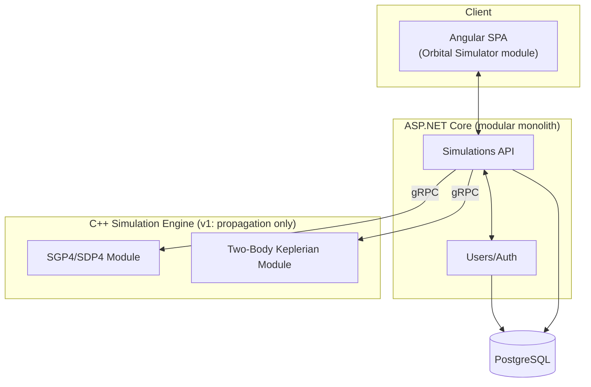

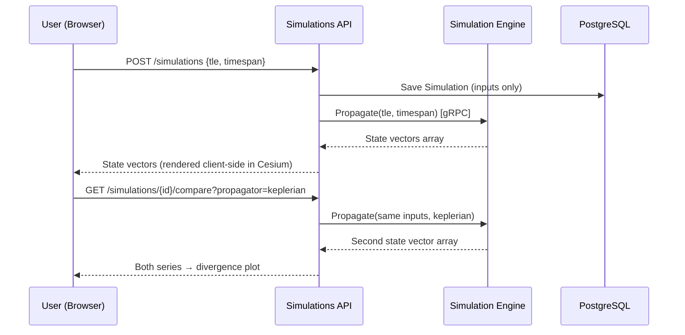

**Data flow note:** results are **not** stored as large time-series blobs — only the *inputs* (TLE/elements, timespan) are persisted. Output state vectors are recomputed on load. This keeps the database small and avoids premature storage-scaling problems for a product whose computations are cheap and fast.

## Technology Stack
- **Angular + TypeScript** (frontend) — you already know it; matches the shared app shell.
- **CesiumJS** — purpose-built for geospatial/orbit visualization; reinventing Earth-ellipsoid + time-dynamic positioning in raw WebGL is wasted effort. *Alternative considered:* Three.js — rejected for this product specifically because Cesium's globe/time/coordinate-frame handling is exactly the domain need.
- **ASP.NET Core (C#)** — backend API; matches existing skill, mature ecosystem.
- **C++ Simulation Engine, exposed via gRPC** — start it now, even though Product 1 only needs propagation, because every later product needs this exact engine and it should never be rewritten. *Alternative considered:* a pure C#/Python SGP4 port with no separate engine — rejected because it would mean re-platforming the physics core later when Products 3–4 need real performance and a stable multi-language contract (C#, and later Python for AI).
- **PostgreSQL** — relational store for users and simulation inputs.
- **Docker Compose** for local dev; **Azure App Service** (not Kubernetes — that's unjustified complexity for one small product) for hosting.

## Backend
```
/apps/api
  /Users            # auth, accounts
  /Simulations      # CRUD, export, comparison orchestration
  /Shared.Contracts # DTOs, gRPC client to engine
/apps/sim-engine
  /propagation
    /sgp4
    /keplerian
  /proto
```
**Patterns:** modular monolith (single deployable, internally modular by folder/namespace); Repository pattern over EF Core; Strategy pattern for propagators (same interface, SGP4 vs. Keplerian — this is the seam Product 6+ numerical propagators plug into later without touching calling code).
**REST APIs:** `/api/v1/simulations` (CRUD), `/api/v1/simulations/{id}/propagate`, `/api/v1/simulations/{id}/compare`, `/api/v1/simulations/{id}/export`.
**WebSockets:** none needed — propagation is fast enough for synchronous request/response; animation is scrubbed client-side over the returned array.
**Auth:** ASP.NET Core Identity, email/password + Google OAuth, JWT; single-tenant per user by design, but the `User` table carries a nullable `org_id` from day one (unused until Product 2) so no migration is needed later.

## Frontend
**Pages:** Dashboard (saved simulations list), Simulation Editor (satellite/TLE input), 3D Viewer (Cesium globe + ground track), Propagator Comparison view (multi-line divergence plot), Export panel, a Learn/Glossary page (orbital-mechanics terms — a genuine acquisition hook for the student segment).
**UI architecture:** single Angular module (`orbital-simulator`), routed under `/simulator/*`, sharing the app shell's auth guard and nav — built as a *lazy-loaded* module specifically so Products 2–5 slot in as sibling modules later without touching this one.

## Database
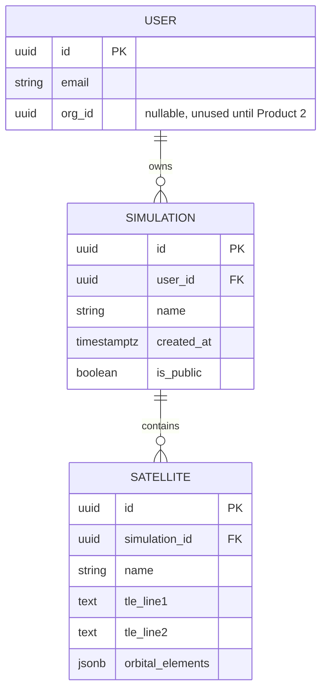
**Indexes:** `(user_id)` on `SIMULATION` for dashboard queries; `(simulation_id)` on `SATELLITE`.
**Future scalability:** this schema is intentionally the seed of the shared schema described in Section 0 — `SATELLITE` here is the same table Product 2's Mission Planner will attach spacecraft configuration to via foreign key, not a new table.

## Deployment
Docker Compose locally (API + engine + Postgres); GitHub Actions CI (build/lint/test/container build) → Azure App Service for API/frontend, Azure Container Instance or App Service for the engine, Azure Database for PostgreSQL. Serilog structured logs → Azure Monitor. Secrets in Azure Key Vault from day one — cheap insurance, and it sets the convention every later product follows without debate.

## Testing
- Unit: propagation modules tested against Vallado's published SGP4 test vectors (golden-file comparison, not hand-checked).
- Integration: API ↔ engine gRPC contract tests.
- Simulation validation: cross-check output against an independent reference implementation (e.g., python-sgp4) for a battery of real published TLEs.
- Regression: golden files re-run on every PR — this is the single most valuable test suite in the whole company, because every later product inherits this engine's correctness.
- Performance: not a concern yet at this scale — basic response-time smoke tests only.

## Documentation
Architecture doc, OpenAPI spec (auto-generated), a physics doc explaining SGP4 and two-body mechanics with references (this doc gets reused, expanded, in every later product), developer onboarding guide, ADR-0001 ("C++ engine as gRPC service from Product 1, not added later").

## Timeline (2-week sprints — 6 sprints / ~12 weeks)

| Sprint | Goals | Tasks | Deliverables | Risks | Success Criteria |
|---|---|---|---|---|---|
| 1–2 | Engine skeleton + SGP4 correctness | C++ engine scaffold, gRPC contract, SGP4 module, golden-file tests vs. Vallado vectors | Engine passing all reference test vectors | Underestimating propagation edge cases (deep-space SDP4) | 100% of test-vector suite passes within published tolerance |
| 3–4 | Backend + auth | ASP.NET Core API, Users/Simulations modules, Postgres schema, gRPC client | CRUD API live locally, auth working | Scope creep into orgs/teams (defer!) | Can create/save/reload a simulation via API |
| 5–6 | Frontend v1 | Angular shell, Dashboard, Simulation Editor, Cesium 3D viewer | End-to-end: create satellite → see it orbit | Cesium learning curve | A user can paste a TLE and watch it orbit in-browser |
| 7–8 | Comparison + export | Keplerian module, comparison view/plot, CZML/CSV/JSON export | Propagator comparison shipped | Plot UX clarity | Divergence plot correctly shows two propagators disagreeing on a known eccentric orbit |
| 9–10 | Polish + sharing | Public share links, glossary page, empty states, onboarding | Shareable simulation links live | — | External test user completes a simulation with zero guidance |
| 11–12 | Deploy + launch prep | Azure deployment, CI/CD, monitoring, billing stub (even if manual invoicing) | Production deployment | Deployment surprises | Product is live at a public URL, first 5 external users onboarded |

## Business Strategy
- **Sellable independently:** yes, and it must be — this is the whole point.
- **Pricing:** Free tier (limited saved simulations, no export, watermarked share links); Pro ($9–15/mo — unlimited saves, export, propagator comparison); University Site License (flat annual fee, ~$500–2,000/yr per department, unlimited student seats).
- **Open-source vs. commercial:** open-core — consider open-sourcing the propagation engine's SGP4 wrapper alone (community goodwill, marketing, credibility with the exact technical audience you're selling to) while keeping the product (UI, hosting, saved sims, sharing, comparison) commercial.
- **First customer segment:** university courses — easiest sales motion (one professor champions it for a class, converts a captive audience of students into future individual/Pro users).
- **Funds:** initial revenue + validated user base directly funds Product 2 development and proves the propagation engine before it becomes load-bearing for everything else.

---

# Product 2 — ASPIS Mission Planner

## Why now
Once orbit propagation is trusted and has real users, the next layer of value is designing the *mission* around that orbit: the spacecraft itself, its payload, ground stations, communication windows, and rough power/fuel budgets. Product 2 is valuable specifically *because* Product 1 exists — a simulation a student built in Product 1 becomes the orbital basis for a real mission plan with zero data re-entry, which is the first real proof of the "products merge without rewrites" thesis.

## Product Vision
- **Problem:** teams doing power/fuel/link budgets in scattered spreadsheets, disconnected from whatever tool computed the orbit.
- **Who pays:** CubeSat/smallsat startups and university teams doing real (not just educational) mission design.
- **Customers:** smallsat systems engineers, mission architects.
- **Why:** built directly on the same propagation engine and `Satellite` entity as Orbital Simulator — import an existing orbit instead of re-specifying it; modern collaborative UI vs. spreadsheets and desktop tools.
- **Competitors:** STK Mission modules, SMAD-style spreadsheet methodology, bespoke internal Excel tools.
- **Unique advantage:** zero re-entry of orbital data from Product 1; a real multi-user Organizations model (introduced here, not before) makes it genuinely collaborative where competitors are single-seat or file-passing.

## MVP
**Exactly what exists:** Organizations & Projects (multi-tenancy starts here); create a Mission that references an existing Product-1 `Satellite` or defines a new one; Spacecraft Builder (mass, power-budget inputs, a small component catalog: battery, panels, radio, one payload); Ground Station catalog + pass/contact-window prediction (reuses the propagation engine); simple orbit-averaged power budget (generation vs. consumption); simple fuel/Δv budget (Tsiolkovsky rocket equation); Mission Timeline (Gantt-style view of passes and payload operations).
**Exactly what does NOT exist:** no live telemetry, no commands, no real-time dashboards, no AI, no failure injection, no subsystem *simulation* (that's dynamic — this product is *budgeting/estimation*, which is static/analytical, a deliberately simpler problem reserved for now).

## Architecture
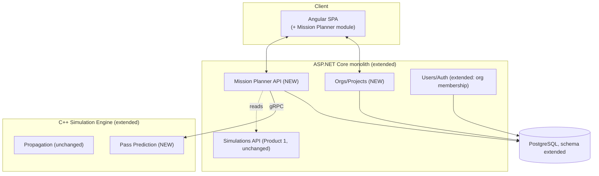

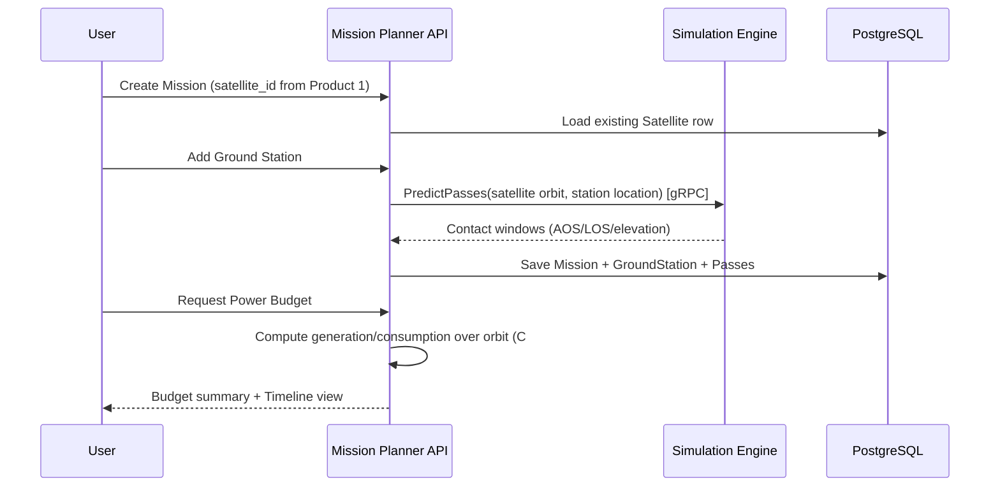

**Integration with Orbital Simulator:** Mission Planner never re-implements propagation — it calls the same engine module and reads the same `Satellite` rows. Pass prediction is added to the C++ engine as a new module (not a new service), because it depends on the same propagation state Product 1 already validated.

## Technology Stack
Same as Product 1 (Section 0 conventions), plus: pass-prediction algorithm added to the existing C++ engine; power/fuel budget math kept in C# (simple enough that it doesn't warrant growing the engine's surface). No new frontend framework, no new database technology.

## Backend
```
/apps/api
  /Orgs             # NEW — organizations, membership, roles
  /MissionPlanner   # NEW — missions, spacecraft config, ground stations, budgets
  /Simulations      # unchanged from Product 1
/apps/sim-engine
  /propagation      # unchanged
  /pass-prediction  # NEW
```
**Patterns:** same modular monolith; Orgs introduces the first real RBAC (Viewer/Editor/Admin at project level) — this is the pattern the Command System in Product 3 will reuse, not reinvent.
**REST APIs:** `/api/v1/orgs`, `/api/v1/projects`, `/api/v1/missions`, `/api/v1/missions/{id}/spacecraft`, `/api/v1/missions/{id}/ground-stations`, `/api/v1/missions/{id}/budget`.
**WebSockets:** still none needed — this product is design-time, not real-time.
**Auth:** extends Product 1's auth with org-scoped claims; the `org_id` field seeded-but-unused in Product 1's `User` table now becomes load-bearing.

## Frontend
**Pages:** Org/Project switcher, Mission Dashboard, Spacecraft Builder (component catalog UI), Ground Station manager (map + pass table), Power/Fuel Budget views, Mission Timeline (Gantt).
**UI architecture:** second lazy-loaded Angular module (`mission-planner`), sibling to `orbital-simulator` under the same shell; a "link to existing simulation" picker is the literal UI expression of the integration story.

## Database
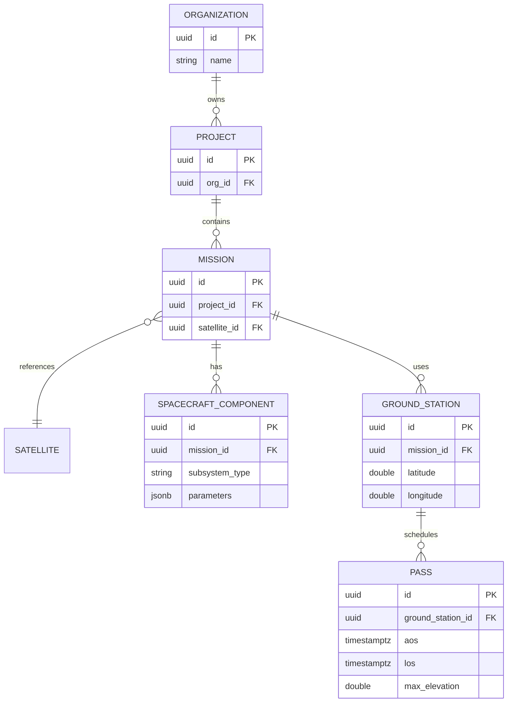
**Indexes:** `(project_id)` on `MISSION`; `(ground_station_id, aos)` on `PASS`.
**Future scalability:** `MISSION` is the row Product 3 (Mission Control) will attach live telemetry to and Product 4 (Digital Twin) will replay — same foreign key, never re-modeled.

## Deployment / Testing / Documentation
Deployment: same Azure App Service pattern as Product 1, still no Kubernetes — two products on one small hosting footprint is still simple. Testing: unit + integration as before, plus scenario tests for pass-prediction (known ground station + known TLE → known contact window, cross-checked against a reference tool). Documentation: extends Product 1's physics doc with a link-budget/pass-geometry section; new ADR-0002 ("Organizations introduced in Product 2, not Product 1 — why").

## Timeline (2-week sprints — 5 sprints / ~10 weeks)

| Sprint | Goals | Tasks | Deliverables | Risks | Success Criteria |
|---|---|---|---|---|---|
| 1–2 | Orgs/Projects + auth extension | Org/membership model, project CRUD, RBAC middleware | Multi-tenant auth working | Retrofitting org scoping into Product 1 tables cleanly | Two users in different orgs can't see each other's missions |
| 3–4 | Mission + Spacecraft Builder | Mission CRUD referencing Satellite, component catalog UI | Can build a spacecraft config against an existing orbit | Catalog scope creep (keep it small: battery, panel, radio, one payload) | A mission can be created that references a Product-1 simulation with zero re-entry |
| 5–6 | Ground Stations + Pass Prediction | Pass-prediction engine module, ground station map UI | Contact window table renders correctly | Geometry edge cases (polar stations, high-inclination orbits) | Predicted AOS/LOS matches a reference tool within seconds |
| 7–8 | Budgets + Timeline | Power/fuel calculators, Gantt timeline view | End-to-end mission plan viewable | Budget math oversimplification | A test mission's power budget flags an under-generation scenario correctly |
| 9–10 | Polish + launch | Multi-user collaboration polish, deploy, onboarding first real mission team | Production launch | — | A real CubeSat/university team completes one mission plan unassisted |

## Business Strategy
- **Sellable independently:** yes — teams that never touch Product 1 directly (they import a TLE) can still buy Mission Planner alone.
- **Pricing:** per-seat team subscription ($30–60/seat/month), since this is inherently collaborative/team software, unlike Product 1's solo use.
- **Open-source vs. commercial:** fully commercial — no OSS component here (unlike Product 1's engine, there's no natural community-goodwill artifact to open-source).
- **First customer segment:** funded early-stage CubeSat startups — higher willingness to pay than students, real budget-estimation pain today.
- **Funds:** recurring per-seat revenue is the company's first real MRR, funding Product 3's larger engineering lift (event system, telemetry pipeline, real-time infra).

---

# Product 3 — ASPIS Mission Control

## Why now
This is the first product requiring real *operational*, real-time infrastructure — the event system, telemetry pipeline, and command authorization that the rest of the roadmap (Digital Twin, AI) depends on. It's deliberately built to work against **simulated** telemetry first, with the ingestion interface designed so a real spacecraft is just a second telemetry *source* later, not a rebuild.

## Product Vision
- **Problem:** existing ground-segment tools (Yamcs, OpenC3/COSMOS) are solid but pure ops — no design linkage, no simulated-telemetry-first workflow, dated collaborative UX.
- **Who pays:** teams that now have a real or soon-to-be-real spacecraft and need to operate it — the natural graduation of a Product-2 customer.
- **Customers:** smallsat operations teams, university teams flying their first CubeSat, training programs simulating ops before a real launch.
- **Why:** works immediately with **simulated** telemetry generated from a Mission Planner spacecraft config — a team can train their ops crew months before a real satellite exists, something Yamcs/COSMOS don't offer out of the box.
- **Competitors:** Yamcs, OpenC3/COSMOS, NASA Open MCT (UI toolkit, not a product), bespoke in-house MCS.
- **Unique advantage:** simulated-telemetry-first design (real training value pre-launch), and it's the same platform that already has your spacecraft's actual configuration and orbit — no separate ops tool to configure from scratch.

## MVP
**Exactly what exists:** live telemetry dashboard (simulated source: the Simulation Engine runs a spacecraft forward using its Product-2 config and Product-1 orbit, publishing fabricated telemetry); command system (build/send/authorize/audit a command against the simulated spacecraft); alerts (threshold-based); mission timeline (event log view); reports (basic PDF export); multi-user collaboration (multiple ops-role users watching/acting on the same mission live).
**Exactly what does NOT exist:** no real spacecraft ingestion yet (explicitly deferred — the *interface* is designed for it now, the *feature* ships later); no AI; no failure-injection UI as a first-class product feature yet (the underlying event tagging is designed now, since it's cheap to include, but the Digital Twin product is what exposes it); no full subsystem *dynamic simulation* beyond what's needed to produce believable telemetry (deep subsystem modeling is Product 4's job).

## Architecture
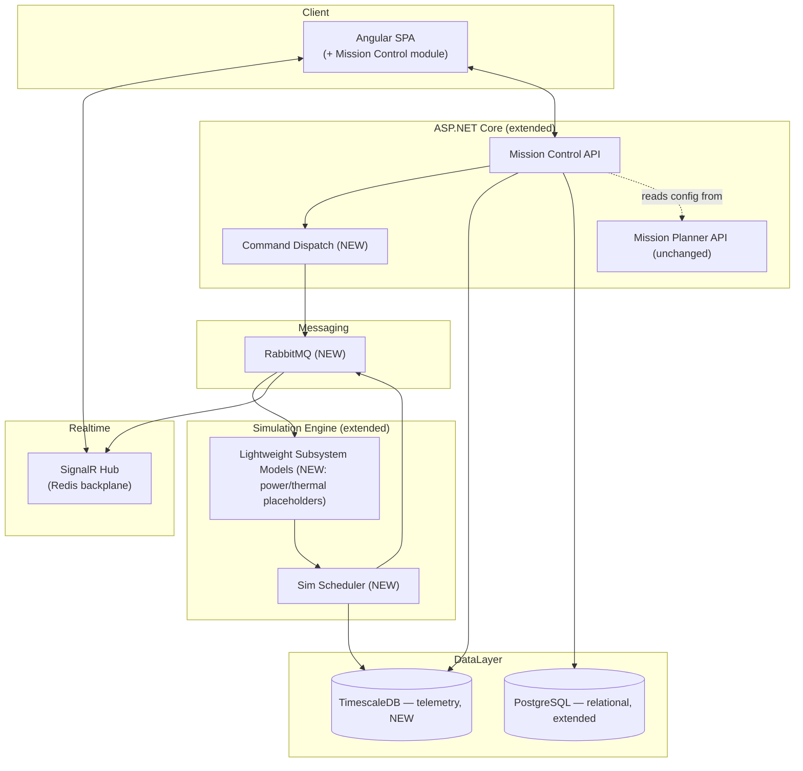

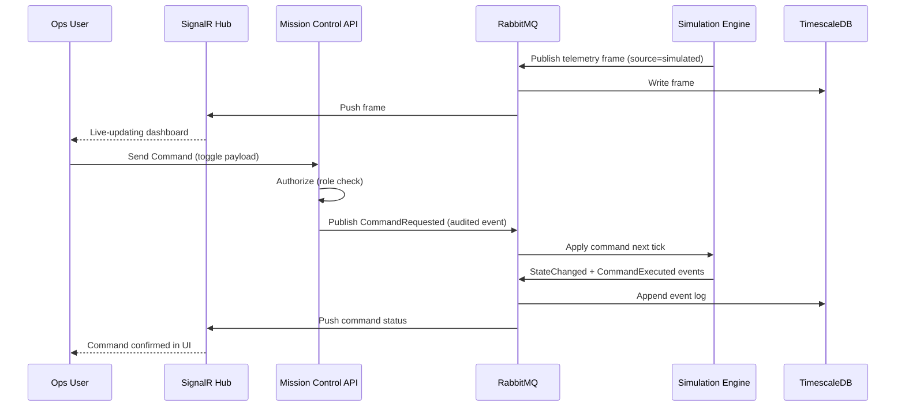

**The single most important design decision in this product:** telemetry ingestion has **one interface**, and "simulated spacecraft" is just the first thing that implements it. When a real spacecraft exists (Phase 7 of the overall company roadmap, far in the future), it publishes onto the exact same RabbitMQ topic the Simulation Engine uses today — Mission Control's dashboard, alerts, and event log code do not change.

## Technology Stack
New additions on top of Sections 0–2's foundation: **RabbitMQ** (command dispatch + event bus — reliable, ordered, appropriate at this volume; Kafka is explicitly not introduced yet — unjustified complexity until real fleet-scale telemetry volume exists); **TimescaleDB extension on the existing Postgres instance** (telemetry hypertables — one database engine, not two); **SignalR + Redis backplane** (real-time push, scales across instances without sticky sessions). *Alternative considered for messaging:* Kafka — rejected for now on the "avoid unnecessary complexity" principle; reassess only when fleet-scale volume demands it.

## Backend
```
/apps/api
  /MissionControl   # NEW — telemetry query, alerts, timeline
  /Commands         # NEW — command dispatch, authorization, audit
  /MissionPlanner   # unchanged
  /Orgs             # unchanged
/apps/sim-engine
  /scheduler        # NEW — multi-rate tick loop
  /subsystems       # NEW — lightweight power/thermal placeholders (deepened in Product 4)
  /propagation      # unchanged
  /pass-prediction  # unchanged
```
**Patterns:** **event sourcing** introduced here for the first time (every state change, command, and future failure-injection is an immutable event) — this is the architectural backbone Product 4 depends on entirely, so the schema is designed carefully now, jointly between both developers, not solo. **CQRS** for telemetry: writes go through the ingestion pipeline, reads go through a separate query path (Timescale continuous aggregates later).
**REST APIs:** `/api/v1/missions/{id}/telemetry` (range queries), `/api/v1/missions/{id}/commands`, `/api/v1/missions/{id}/alerts`, `/api/v1/missions/{id}/events`, `/api/v1/missions/{id}/reports`.
**WebSockets:** `TelemetryHub`, `CommandStatusHub`, `AlertHub` — the product's first real-time surface.
**Auth:** extends Product 2's RBAC with a dedicated elevated "can send commands" permission, separate from "can view telemetry" — never bundle these by default.

## Frontend
**Pages:** Mission Dashboard (live status), Telemetry Charts (streaming + historical), Command Console (builder, queue, history), Alerts feed, Mission Timeline (event log, the seed of Product 4's replay scrubber), Reports.
**UI architecture:** third lazy-loaded module (`mission-control`); this is the first module that needs a persistent WebSocket connection managed at the shell level rather than per-page.

## Database
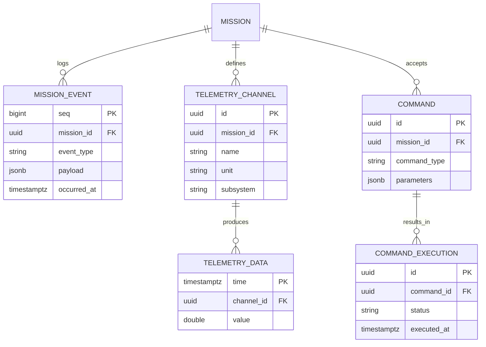
**Indexes:** Timescale hypertable partitioning on `TELEMETRY_DATA` gives `(channel_id, time)` automatically; `(mission_id, occurred_at)` on `MISSION_EVENT`.
**Future scalability:** `MISSION_EVENT` is precisely the table Product 4 (Digital Twin) folds over to reconstruct state for replay — designed once, here, used forever after.

## Deployment / Testing / Documentation
Deployment: this is the point Kubernetes (AKS) genuinely becomes justified — multiple stateful real-time components (SignalR, RabbitMQ, Timescale) and the first product needing horizontal scale of the simulation worker per active mission session. Testing: event-schema determinism tests (same command sequence → same resulting state, always); load test telemetry ingestion (k6) before onboarding real ops teams; scenario tests for command authorization (unauthorized user cannot send a command, full stop). Documentation: `/docs/simulation/event-schema.md` (the most important document in the company), command-system security doc, deployment runbook.

## Timeline (2-week sprints — 6 sprints / ~12 weeks)

| Sprint | Goals | Tasks | Deliverables | Risks | Success Criteria |
|---|---|---|---|---|---|
| 1–2 | Event schema + scheduler | Joint design session on event schema, C++ scheduler, RabbitMQ setup | Event schema ADR + working scheduler | Getting this wrong is expensive later — budget real design time | Two engineers agree on and sign off the event schema before writing consuming code |
| 3–4 | Telemetry pipeline | Ingestion → Timescale, TelemetryHub, basic dashboard | Live-updating simulated telemetry in browser | Real-time infra unfamiliarity | Dashboard updates within 1s of a simulated tick |
| 5–6 | Command system | Command builder, authorization, CommandDispatch, audit log | End-to-end command → telemetry effect | Under-scoping authorization rigor | An unauthorized user is provably blocked from sending a command |
| 7–8 | Alerts + Timeline | Threshold alert rules, event-log timeline UI | Alerts fire correctly on threshold breach | Alert-fatigue false positives | A known injected threshold breach produces exactly one alert |
| 9–10 | Reports + multi-user | PDF report generation, multi-user live collaboration polish | Two users watching the same mission live | Redis backplane scale-out bugs | Two browser sessions see identical live state simultaneously |
| 11–12 | Deploy + launch | AKS migration, load testing, first real ops-team onboarding | Production launch | k8s migration time-sink | First customer runs a full simulated ops session unassisted |

## Business Strategy
- **Sellable independently:** yes — Yamcs/COSMOS users are a direct switch target even without Products 1–2.
- **Pricing:** SaaS subscription, priced per-satellite-per-month (the natural ops-tooling unit), tiered by number of concurrent users/telemetry channels.
- **Open-source vs. commercial:** commercial — this is the recurring-revenue backbone of the company, not a candidate for OSS.
- **First customer segment:** existing Product-2 customers graduating to ops (natural upsell, zero new-customer acquisition cost).
- **Funds:** this product's recurring per-satellite revenue is what funds the larger engineering investment in Product 4 (Digital Twin) and Product 5 (AI).

---

# Product 4 — ASPIS Digital Twin

## Why now
Products 1–3 exist independently and each generate revenue. Digital Twin is the first product that is *explicitly* an integration — it doesn't introduce a new customer-facing capability so much as it deepens and connects what already exists: real subsystem *simulation* (not just budgets), failure injection, replay, and scenario comparison, all sitting on top of the event-sourced foundation Product 3 already built.

## Product Vision
- **Problem:** none of Products 1–3 alone let you run a "what if" — what if the battery degrades, what if a command is sent differently, what if we compare two mission designs side by side against the same fault.
- **Who pays:** the same ops/engineering teams already on Products 2–3, now wanting deeper simulation fidelity and training capability — this is the natural **Pro/Enterprise upsell**, not a new market.
- **Customers:** mission assurance engineers, training programs, ops teams preparing for a real launch.
- **Competitors:** Basilisk/42 (research-grade simulators, not products), nothing commercial combines design+ops+twin at this integration depth.
- **Unique advantage:** this product is *impossible* to build well without Products 1–3 already existing and sharing data — a direct competitor would have to build all four at once.

## MVP
**Exactly what exists:** real subsystem simulation (power/thermal/ADCS models replacing Product 3's lightweight placeholders); Failure Injection (fault catalog + injection API, tagged events in the existing event log); Mission Replay (scrubber over the event log — exact re-simulation, not just frame playback); Scenario Comparison (fork a twin, run two variants side by side).
**Exactly what does NOT exist:** no AI yet (that's Product 5, strictly); no real-spacecraft ingestion (still deferred, same interface reused).

## How the Digital Twin communicates with everything else
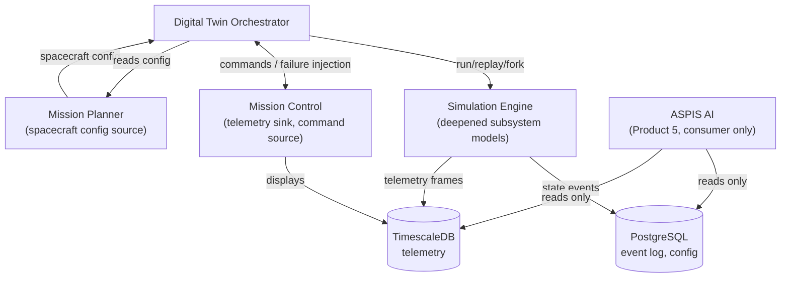
- **Mission Planner:** the twin's starting configuration is a Mission Planner spacecraft/orbit — never re-entered.
- **Mission Control:** commands and failure injections both arrive as events through the same Command Dispatch built in Product 3; telemetry the twin produces is displayed by the same dashboards.
- **Simulation Engine:** gains real (not placeholder) power/thermal/ADCS modules here — the engine's third major growth phase, still the same service, still gRPC.
- **AI:** deliberately **read-only** against the event log and telemetry — Product 5 never writes to sim state, by design, so AI failures can never corrupt the twin.
- **Database:** no new tables beyond `FAILURE_SCENARIO` and a `MISSION_FORK` relationship on `MISSION` — everything else already existed from Product 3.

## Technology Stack / Backend / Frontend
No new languages or platforms — this product is depth, not breadth. Engine gains real physics modules: quaternion attitude dynamics, lumped thermal nodes, Ah-counting battery model. Backend gains `TwinOrchestrator` as the **first service extracted out of the modular monolith** — done now, not earlier, because its boundary (start/stop/snapshot/fork a twin) is finally stable and proven. Frontend gains the Replay Scrubber and Scenario Comparison view as new pages in a fourth lazy-loaded module (`digital-twin`).

## Database (additions only)
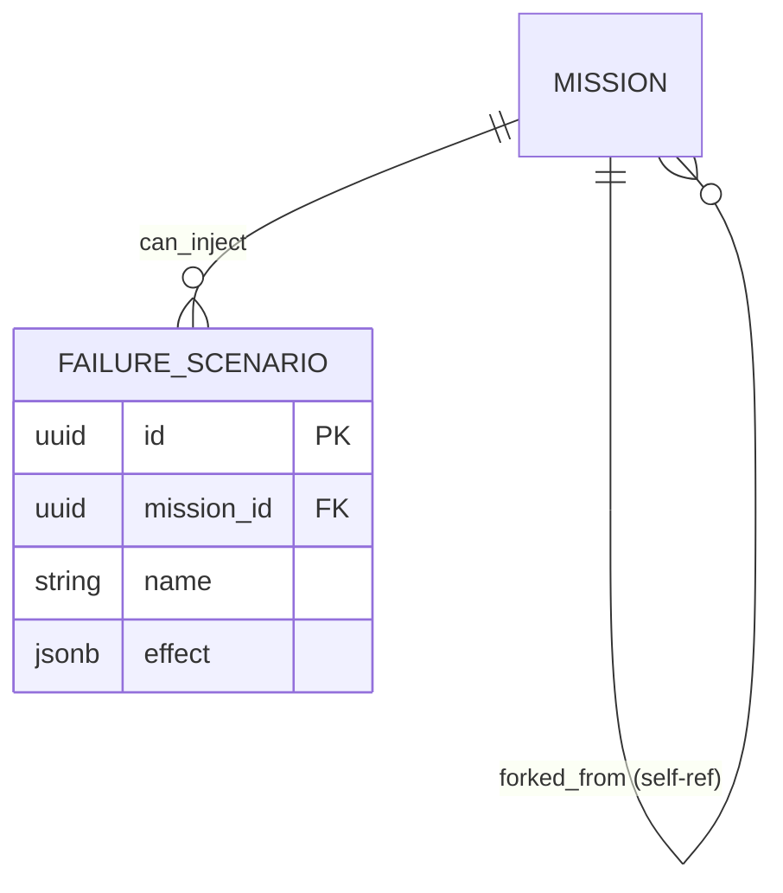

## Deployment / Testing / Documentation
Deployment: first genuinely multi-service production deployment (TwinOrchestrator as its own pod, independent scaling from the core API). Testing: scenario tests — inject a known fault, assert the expected telemetry/alert sequence, exactly reproducible on replay (determinism is now a hard product requirement, not just an engineering nicety). Documentation: `/docs/simulation/failure-injection-catalog.md`, `/docs/architecture/twin-orchestrator.md`, ADR on the monolith→service extraction.

## Timeline (2-week sprints — 6 sprints / ~12 weeks)
| Sprint | Goals | Deliverables | Success Criteria |
|---|---|---|---|
| 1–2 | Real power/thermal models | Lumped-node thermal, Ah-counting battery replacing placeholders | Golden-file validated against Product 3's simplified output as a sanity baseline |
| 3–4 | ADCS module | Quaternion attitude dynamics, basic torque model | Validated against a published attitude-dynamics test case |
| 5–6 | TwinOrchestrator extraction | Service split, gRPC contract to core API | Zero behavior change for existing Product 3 users during migration |
| 7–8 | Failure Injection | Fault catalog, injection API, event tagging | Instructor can inject a fault mid-mission and see correct downstream alerts |
| 9–10 | Replay + Scenario Comparison | Exact re-simulation replay, mission fork UI | Replaying a mission from its event log reproduces bit-identical telemetry |
| 11–12 | Deploy + upsell rollout | Ship as Pro/Enterprise tier to existing customers | First existing customer upgrades specifically for Digital Twin features |

## Business Strategy
- **Sellable independently:** technically no — it requires Products 2 and 3's data to mean anything — and that's fine, it's designed as an upsell, not a standalone SKU.
- **Pricing:** Pro/Enterprise tier on top of the Mission Control subscription (not a separate product purchase).
- **Open-source vs. commercial:** commercial — this is the deepest IP in the company.
- **First customer segment:** existing Mission Control customers, upgrading.
- **Funds:** premium-tier revenue funds Product 5's AI/ML engineering investment, which is the most expertise-intensive and slowest-to-monetize product in the lineup.

---

# Product 5 — ASPIS AI

## Why last, and why it must never exist independently
AI without Products 1–4's data is a demo, not a product — there is no labeled fault data, no event log, no telemetry, nothing to be intelligent *about*. Every AI feature below is scoped by exactly what data it needs and where that data already lives inside the ecosystem you already built.

## AI Features — data, source, and model choice

| Feature | Data needed | Where it comes from | Model type | Why this type |
|---|---|---|---|---|
| **Anomaly Detection** | Nominal + off-nominal telemetry, per subsystem | Mission Control telemetry (Product 3) + Digital Twin failure injection (Product 4) for labeled faults | Traditional ML (isolation forest, statistical control charts first; autoencoders once volume justifies it) | Telemetry anomaly detection doesn't need deep learning's capacity at this data scale — simpler models are more explainable, which ops teams need to trust an alert |
| **Predictive Maintenance** | Long-horizon degradation trajectories (battery fade, fuel depletion) | Digital Twin's simulated degradation sweeps (Product 4) — the synthetic-data moat described in the shared foundation | Deep learning (LSTM / temporal transformer) | Degradation is a genuinely sequential, long-horizon pattern-recognition problem — this is where DL's capacity earns its cost |
| **Orbit Optimization** | Orbit/constellation design space, mission objectives | Orbital Simulator (Product 1) + Mission Planner (Product 2) constraints | Traditional optimization (gradient/combinatorial), RL only for constellation-scale search | Most orbit optimization is a well-posed numerical optimization problem — don't reach for RL until search-space complexity actually demands it |
| **Mission Planning Assistant** | Component catalog, budget rules, best-practice knowledge | Mission Planner (Product 2) schema + a curated knowledge base | LLM + RAG | Advisory, conversational, needs to reason over unstructured "why" — the right job for an LLM, wrong job for traditional ML |
| **Telemetry Summaries** | Event log + telemetry over a time range | Mission Control (Product 3) | LLM (summarization) | Natural-language generation over structured data — LLM's core strength |
| **Root Cause Analysis** | Anomaly candidates + correlated multi-subsystem event log | Anomaly Detection output + Digital Twin event log | Hybrid: ML surfaces candidates, LLM synthesizes the cross-subsystem explanation | Neither model type alone solves this — detection is statistical, explanation is linguistic/causal |
| **Natural Language Queries** | The full relational + time-series schema | All products' databases | LLM + RAG / text-to-SQL | Query interface, not a prediction task |
| **Autonomous Recommendations** | Everything above, composed | All products | RL/optimization + LLM narration | Longest-horizon feature — ships last, after every other AI feature has proven the data pipeline and trust model |

## Training strategy
The core advantage stated once, clearly: **because ASPIS owns the Simulation Engine and Failure Injection module, it can generate labeled fault data at arbitrary scale** — something a real satellite operator with only real (rare) fault history cannot do. Public benchmark datasets (e.g., NASA's SMAP/MSL telemetry anomaly set) are used only to validate that models generalize beyond simulator-specific bias, never as primary training data. Real customer telemetry, once Product 3/4 customers have real spacecraft (with explicit consent), becomes a genuine proprietary data moat layered on top of the synthetic foundation — but is never assumed to exist before then.

## Architecture
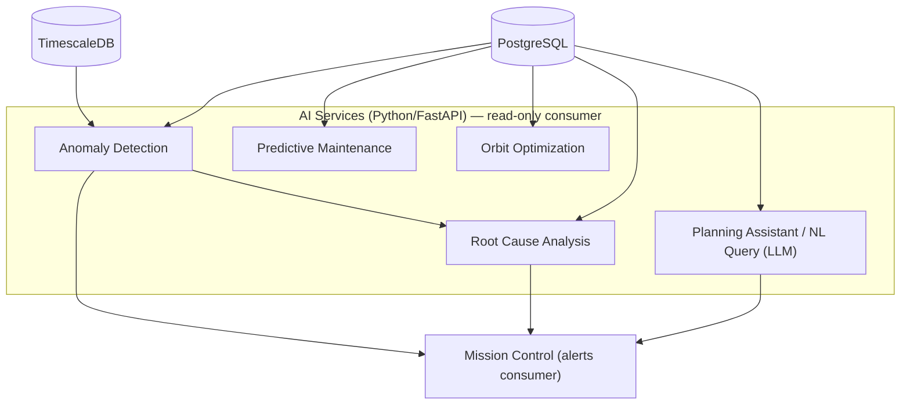
AI services are architecturally **read-only** against every other product's data — this is a hard boundary, not a convention, enforced at the database credential level (AI services connect with a read-only role).

## Timeline (2-week sprints — 7 sprints / ~14 weeks, features shipped incrementally, not all at once)
| Sprint | Goals | Deliverables | Success Criteria |
|---|---|---|---|
| 1–2 | Rule-based Anomaly Detection v1 | Threshold/statistical alerts wired into Mission Control | Proves the AI→Mission-Control integration path with zero ML risk |
| 3–4 | ML Anomaly Detection v2 | Isolation forest / autoencoder trained on Digital Twin synthetic data | Model detects injected faults it wasn't explicitly trained on |
| 5–6 | Predictive Maintenance | LSTM battery-fade model | Forecast within acceptable error on held-out simulated degradation runs |
| 7–8 | Orbit Optimization | Optimization service over Orbital Simulator engine | Produces a demonstrably better orbit/constellation than manual design for a test case |
| 9–10 | Root Cause Analysis | ML + LLM hybrid pipeline | Given an injected multi-subsystem fault, produces a correct causal explanation |
| 11–12 | Mission Planning Assistant + NL Query | RAG pipeline over Mission Planner + full schema | Answers real user questions about their own mission data correctly |
| 13–14 | Autonomous Recommendations (v1, narrow scope) | One well-scoped recommendation flow (e.g., contact scheduling) | Recommendation accepted by a real ops team without modification in a pilot |

## Business Strategy
- **Sellable independently:** no, by design — it's an add-on module, priced on top of Products 3/4.
- **Pricing:** usage-based or per-model add-on pricing layered onto existing subscriptions (e.g., "+$X/mo per satellite for AI anomaly detection," LLM features metered by usage).
- **Open-source vs. commercial:** commercial, though publishing research (e.g., a paper on synthetic-fault-data training) is good for hiring and credibility.
- **First customer segment:** existing Digital Twin (Product 4) customers — again, an upsell, not new acquisition.
- **Funds:** by this point ASPIS should be cash-flow positive from Products 1–4; Product 5 is funded by the company, not by needing its own bootstrap revenue.

---

# Integration Roadmap

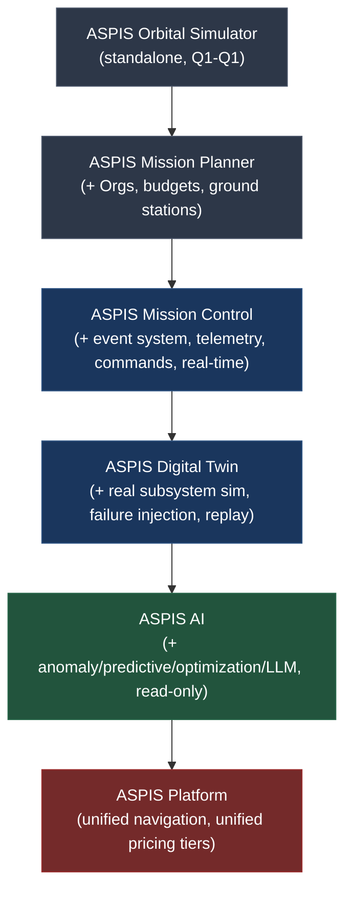

**What's shared, concretely, and never rebuilt:**
- **Frontend shell:** one Angular app, five lazy-loaded modules — the "platform" is largely just turning on cross-module navigation and a unified dashboard once all five exist.
- **C++ Simulation Engine:** grows from propagation-only (P1) → +pass-prediction (P2) → +scheduler/lightweight subsystems (P3) → +real subsystem physics (P4) → consumed read-only by P5. Never rewritten, only extended behind the same gRPC contract.
- **Database:** one Postgres instance, one schema that grows by addition — `SATELLITE` (P1) → `MISSION`/`SPACECRAFT_COMPONENT`/`GROUND_STATION` (P2) → `MISSION_EVENT`/`TELEMETRY_*`/`COMMAND` (P3) → `FAILURE_SCENARIO` (P4) → read-only access for P5.
- **Auth/Identity:** `User` table exists from P1 with an unused `org_id`; P2 makes it load-bearing; P3 adds command-authorization claims; nothing here is ever migrated, only extended.
- **Event schema:** designed once in P3, consumed by P4 (replay/failure injection) and P5 (AI, read-only) without modification.

**How each product evolves without rewriting previous work:** every product above is described as an *addition* to a prior product's schema, API surface, or engine module — never a replacement. The one deliberate exception, called out explicitly, is the Product 4 extraction of `TwinOrchestrator` out of the monolith into its own service — done only once that specific boundary was proven stable across three prior products' worth of usage, which is exactly the discipline ("split when justified, not by default") the constraints call for.

---

# Business Strategy Summary

| Product | Standalone? | Pricing model | First segment | Role in funding roadmap |
|---|---|---|---|---|
| Orbital Simulator | Yes | Freemium + university site license | Students/hobbyists/universities | First revenue, validates engine |
| Mission Planner | Yes | Per-seat team subscription | Funded CubeSat startups | First real MRR |
| Mission Control | Yes | Per-satellite/month SaaS | Graduating P2 customers | Recurring-revenue backbone |
| Digital Twin | No (upsell) | Pro/Enterprise tier | Existing P3 customers | Funds AI investment |
| AI | No (add-on) | Usage/per-model add-on | Existing P4 customers | Company should be cash-flow positive by here |

Once all five are live and used, they consolidate into unified ASPIS pricing tiers (Free / Pro / Team / Enterprise) spanning the whole platform — but that consolidation is a pricing-page exercise at that point, not an engineering rewrite, because the integration discipline above was followed from Product 1 onward.

---

**Where to start, concretely:** Product 1, Sprint 1 — stand up the C++ engine skeleton and get SGP4 passing Vallado's reference test vectors. Everything else in this document is downstream of that one validated result.
